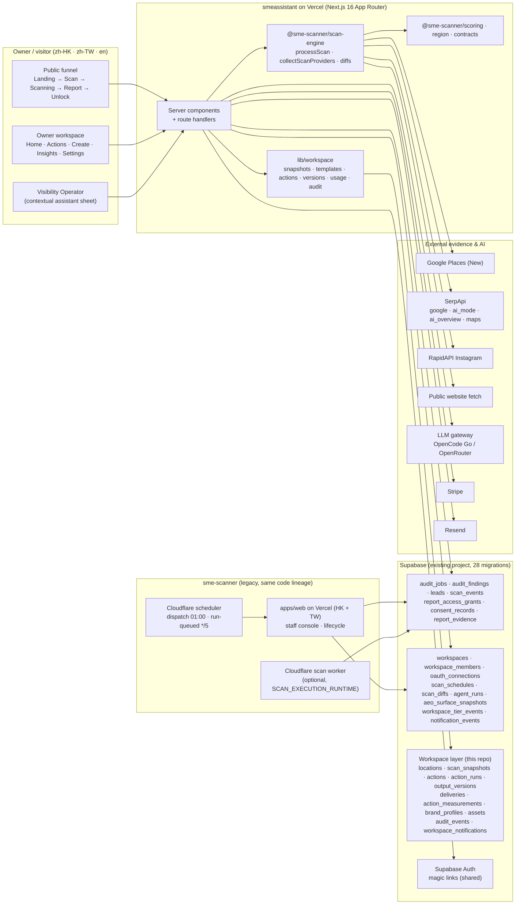

# CLAUDE.md — SME Scanner Visibility Workspace (`YNWAforever/smeassistant`)

> **What this file is.** The operating manual + executable integration playbook for Claude Code in this repo.
> Part A (sections 0–3) is always-on context and contracts. Part B (section 4) is the phased playbook.
> Sections 5–7 are content rules, verification and pitfalls. Appendix D is the decisions log. Read Part A fully before touching code.
>
> **Mission.** Turn the ChatGPT-Sites prototype in this repo (the design that lives at
> `https://sme-scanner-visibility-workspace.laichiwillyjp.chatgpt.site`) into the production
> **SME Scanner Visibility Workspace**, running on **Vercel + standard Next.js 16**, powered by the
> already-built backend in **`YNWAforever/sme-scanner`** (`origin/main`) and its **existing Supabase project**.
> The final, integrated code lives **here**.
>
> **Owner:** Willy Lai (Fimmick / Kinnso). **Markets:** Hong Kong (HKD, WhatsApp) and Taiwan (TWD, LINE).
> **UI locales:** `zh-HK` (default), `zh-TW`, `en`. Interface language never changes market or currency.
>
> **Base (decided 2026-09-03):** sme-scanner **`origin/main` at `b9b4151fb89217a926e38f187873b5ff9f10f90f`**
> (2026-08-27, PR #86). This file was regenerated against that commit after the Phase 0 discovery
> (`docs/integration/PHASE-0-REPORT.md`) showed the previous playbook described a stale, diverged local checkout.
> The checkout at `C:\Users\laich\Documents\smescanner` (local `main` 8415a327) is **not a source for anything**.

---

## How to use this file

```text
# Kick-off (run from the smeassistant repo root, with the upstream checkout next to it)
claude
> Read CLAUDE.md. Run the Phase 0 discovery checklist, report findings, then execute Phase 0.
> After each phase: run the phase's verification block, commit, and stop for review.
```

- Work **one phase at a time**, in order. Each phase ends with a green verification block and a commit on
  branch `feat/visibility-workspace-integration`.
- `SME_SCANNER_SRC` = path to the upstream checkout. Default `../sme-scanner-upstream`
  (Willy's machine: `C:\Users\laich\Documents\sme-scanner-upstream`, a clone of `origin/main`). It must be at the
  pinned SHA (Phase 0.1 checks this). **Never modify that repo; only read/copy from it.**
- Upstream keeps moving. Anything newer than the pinned SHA is adopted **only** by re-pinning here, re-running
  Phase 0.1, and re-checking §1.2/§1.3 — never by "or newer".
- If something in this file contradicts the code you find, **stop and report** the discrepancy in the phase
  report instead of guessing. Phase 0.1 exists to catch drift.
- Decisions 2–11 from the discovery report were taken as the recommended options and are recorded in
  Appendix D as **assumptions Willy can override**. When in doubt, the guardrails in §0 win.

---

# PART A — ALWAYS-ON CONTEXT

## 0. Non-negotiable product truths (guardrails)

These are the product's promises. Every page, API and prompt must respect them. They come from the
prototype copy (`/methodology`, `/trust`, `/pricing`) and are the differentiator of the product.

1. **Evidence before score.** Every finding/metric carries `source`, `observed_at`, `coverage/state`
   and a plain-language limitation. Never show a number without its provenance.
2. **Unavailable ≠ zero.** Provider states are distinct: `measured | unavailable | unsupported | failed | pending`.
   Missing evidence reduces **coverage**, never the **score**. The upstream scorer is already coverage-aware:
   `overall` is `null` unless ≥ 2 of ig/gbp/aeo are measured, and unmeasured modules have `score: null`
   (§3.5). Never re-introduce placeholder numbers.
3. **Comparable before change.** Two scans are compared only when the comparability rule (§3.5.3, which
   is upstream's `diffScans`) passes. Never draw a trend line across a coverage gap or a scoring-version change.
4. **Six fact-type labels** on every claim: `Observed | Inference | Recommended | Attributed | Estimated | Unknown`.
   Revenue, bookings and customer intent are **Unknown** unless measured. A before/after change is
   at most **Attributed** (temporal association), never "caused".
5. **Owner approval is a boundary.** AI output is a *draft* until an authorised person approves **one
   immutable version**. Editing an approved version creates a new draft and resets approval.
6. **Never auto-publish.** Delivery is a separate state transition. v1 delivery = **export/copy only**;
   direct publishing stays disabled until a verified connector with explicit scope exists.
7. **Approved deliveries, not tokens.** One delivery is counted only after an exact version is approved
   **and** first exported/published. Generation, revisions, rejections, rescans and failed runs cost nothing.
8. **Separate lifecycle states.** `action_state`, `run_state`, `approval_state`, `delivery_state`,
   `measurement_state` are tracked independently; the customer-facing "phase" is *derived*, never stored.
9. **Server-enforced scope.** Every mutation verifies role (owner/manager/viewer), workspace membership,
   location scope, entitlement and integration permission. A demo role in the UI is not authority.
   Wrong-workspace or revoked-membership links **fail closed**.
10. **Append-only accountability.** Actions, edits, decisions, exports, runs and scans emit an audit event.
11. **Locale ≠ market.** `market` (`hk|tw`) is chosen explicitly and stored on the job/workspace;
    the UI locale only chooses display language. (Upstream rule: `localeToMarket`, `zh-TW → tw`, else `hk`.)
12. **Demo data stays on demo pages.** `/sample-report`, `/demo-workspace` and the public assistant use
    fixed, sanitised Kam Man House data (`lib/demo-data.ts`, `lib/pocket-assistant/demo.ts`).
    Real workspaces never read from those files.
13. **Public evidence only, purpose-limited.** The free scan collects public evidence; unlock/claim
    require separate explicit consent (upstream writes policy-versioned `consent_records`); marketing consent
    is never bundled.
14. **Owner-confirmed facts only in generated content.** Never invent ingredients, allergens, prices,
    offer dates, capacity, booking policies or legal claims. Missing facts → `needs_input`, not guesses.
15. **Ownership is proven, never self-declared.** A workspace is attached to a scan only by (a) Google attesting
    that the signed-in user manages the Business Profile (OAuth-verified claim) or (b) Fimmick staff assignment.
    Email-match self-service claim is a scan-hijack primitive and stays off (`OWNER_SELF_SERVICE_CLAIM` unset).
16. **One backend, one database, one scorer.** The legacy `sme-scanner` app keeps running against the same
    Supabase project until cut-over. Both apps must run the same `@sme-scanner/scoring` `scoringVersion`
    (`"2026-08-16"` at the pin) and the same `claim_audit_job` lease; anything else corrupts comparability.

## 0.1 Working agreements for Claude Code

- Package manager: **pnpm 9.12.0 via corepack**. Root `package.json` carries `"packageManager": "pnpm@9.12.0"`;
  run `corepack pnpm <cmd>` (no global pnpm on Willy's machine; `corepack enable` is optional). Node **>= 22.13**
  (`.nvmrc` = `22`). Do not reintroduce npm lockfiles.
- Keep the build green at every commit: `corepack pnpm typecheck && corepack pnpm lint && corepack pnpm test && corepack pnpm build`.
- **Tests never call paid providers** (RapidAPI, Google Places, SerpApi, LLM, Stripe, Resend). Use injected
  dependencies (upstream's `ScanProcessorDependencies`, `GBPCollectorDependencies`) and fixture payloads (§3.2.1).
- **Never** apply a remote migration, run a live paid scan, deploy, `git push`, or open a PR unless Willy
  explicitly asks for that action in the current session. Prepare the command and stop.
- **Migrations are hand-applied** through the Supabase dashboard after `supabase/verify-migrations.sh` passes
  (§1.3.6). There is no Supabase CLI workflow and no `supabase db push`.
- Never commit secrets. `.env*.local` stays ignored. Keep `.env.example` complete (Appendix A).
- Preserve the visual design: reuse `app/globals.css`, `app/ramp-refresh.css`, `app/responsive.css`,
  the shadcn components in `components/ui/*` and the existing class names. Change layout/content per §5,
  not by restyling.
- Prefer server components for data loading; keep client components for interaction only.
- Write TypeScript strict; no `any` in new code. Vendored upstream packages keep their existing typing; scope
  `@typescript-eslint/no-explicit-any` off for `packages/**` only (upstream's SerpApi/RapidAPI/Places JSON boundary).
- Vendored packages are copied **verbatim** at the pinned SHA. Local changes to them are recorded in
  `packages/<name>/VENDOR.md` (source SHA, file list, diffs) so re-pinning is mechanical.
- Commit per task with conventional messages (`feat:`, `fix:`, `refactor:`, `chore:`, `docs:`, `test:`).
  Branch: `feat/visibility-workspace-integration`.
- When a phase ends, write `docs/integration/PHASE-<n>-REPORT.md` (what changed, decisions, open questions,
  exact verification output).

---

## 1. Source-of-truth map

### 1.1 This repo today (the prototype) — what exists

Generated by ChatGPT Sites ("vinext" starter). Two commits (`6fad2ef Initialize SME Assistant repository`,
`9b37f41 Add contextual Visibility Operator experience`). Root package name `sme-scanner-visibility-workspace`,
`"type": "module"`, `engines.node >= 22.13.0`, no `packageManager` pin, npm `package-lock.json`.

| Area | Files | Notes |
|---|---|---|
| Runtime scaffolding (to be removed) | `vite.config.ts`, `worker/index.ts`, `build/sites-vite-plugin.ts`, `scripts/*.sh`, `.openai/hosting.json`, `.npmrc`, `db/*`, `drizzle/*`, `drizzle.config.ts`, `examples/d1/*`, `app/chatgpt-auth.ts` (+ its 3 call sites in `app/[...path]/page.tsx:2,38,48-50,61`), `tests/rendered-html.test.mjs`, `tsconfig.tsbuildinfo` (401 KB, committed), `package-lock.json`, the `codex-preview` meta in `app/layout.tsx:14-16` | Cloudflare Worker + D1 + ChatGPT sign-in. Replaced by Vercel + Supabase Auth. |
| Routing | `app/page.tsx`, `app/[...path]/page.tsx`, `components/sme-prototype.tsx` | A single catch-all that dispatches to page components by path segments. Replace with real App Router segments (§3.1). |
| Layout & shell | `components/product-ui.tsx` | `PublicHeader`, `PublicPageFrame`, `WorkspaceShell` (sidebar + topbar + mobile bottom nav; `scopedHref` appends `?location=`; location whitelist `["all","tin-hau","yik-yam"]` defaulting to `yik-yam` at `:288`), `WorkspacePageFrame`, `EnvironmentBar`, `ScoreDial`, `LoopRibbon`, `CapabilityBadge`, `ProviderBadge`, `DemoBadge`, `FactType`, `PageIntro`, `SectionCard`. **Keep.** |
| Public pages | `components/public-pages.tsx` | `LandingPage`, `ScanPage` (4 steps), `ScanningPage`, `ReportPage`, `UnlockPage`, `PricingPage`, `MethodologyPage`, `TrustPage`, `SignInPage`, `OnboardingPage`, `SelectWorkspacePage`. Trilingual copy inline. Three Pexels ``s with attribution. |
| Owner workspace | `components/workspace-home.tsx` (`OwnerHomePage`), `components/workspace-actions.tsx` (`ActionsPage`, `ActionDetailPage` incl. versions/approval/export state machine), `components/workspace-operations.tsx` (`CreatePage`, `InsightsPage`, `AssetsPage`, `CalendarPage`, `ActivityPage`, `BrandSettingsPage`, `IntegrationsPage`, `TeamPage`, `BillingPage`, `NotificationsPage`, `MorePage`; private helper `downloadText` at `:39-47`), `components/public-demo-workspace.tsx` | All read hard-coded data from `lib/demo-data.ts`. `kam-man-house` / 錦汶館 / `Willy Lai` / `tin-hau` / `yik-yam` are hard-coded in ~50 places across these files, `public-pages.tsx` and `assistant-sheet.tsx` (Phase 2 step 6). |
| Visibility Operator (assistant) | `components/pocket-assistant/*` (`ContextualAssistant` + `AssistantSurface` type live in `assistant-sheet.tsx`), `lib/pocket-assistant/{contracts,demo}.ts`, `app/api/pocket-assistant/demo/route.ts` | 13 fixed intents (`demoQuestionIds`), surfaces, evidence refs, artifact preview, "create new version" hook. Two callers of the demo route: `assistant-sheet.tsx:111` and `workspace-operations.tsx:68` (`CreatePage.startDraft`). Keep the contract; add a live mode. |
| Copy / i18n | `lib/copy.ts` (`supportedLocales`, `normaliseLocale`, nav/landing/home/common strings) + inline `isChinese ? … : …` ternaries | Keep approach; centralise **new** strings in `lib/copy.ts`. **No `next-intl` in this repo.** |
| Demo data & domain types | `lib/demo-data.ts` | `Capability`, `ProviderState`, `ActionState`, `RunState`, `ApprovalState`, `DeliveryState`, `MeasurementState`, `DemoAction`, merchant/locations/comparableScans/providers/actions/draftVersions/integrations/activity/analyticsEvents. **These enums become the production domain types (§3.4).** |
| Design system | `app/globals.css` (imports Tailwind v4, `tw-animate-css`, `vendor/shadcn-tailwind-4.13.0.css`, workspace/queue/insights CSS), `app/ramp-refresh.css` (public + workspace theme, 3,099 lines), `app/responsive.css`, `components.json` (shadcn new-york, neutral, CSS vars, aliases incl. `hooks`) | Tokens: ink `#172019`, teal `#0d6b5d`/`#167356`, sidebar `#173b34`, lime accent `#caf36a`, paper `#fffefa`, canvas `#f5f3ed`/`#f7f8f1`, amber `#a86111`, destructive `#b63c36`; fonts `Inter, Aptos, Noto Sans TC, PingFang TC`; radii 8–24px + pills. `hooks/use-mobile.ts` (`useIsMobile`) is required by `sidebar.tsx` and `assistant-sheet.tsx`. |
| Tests | `tests/ui-components.test.mjs` (node:test + vite SSR; 4 cases) | Keep cases 2–4 (Progress aria, ChartStyle media dark mode, Sidebar skeleton determinism); case 1 depends on the vinext `dist/`. Port to vitest. |
| Dependencies | `next 16.2.6`, `react 19.2.6`, `react-dom 19.2.6`, `typescript 5.9.3`, `tailwindcss 4.2.1` + `@tailwindcss/postcss`, `eslint 9.39.4` + `eslint-config-next 16.2.6` (core-web-vitals **and** typescript), `lucide-react 1.31`, `radix-ui 1.6.7`, `sonner`, `next-themes` (used by `components/ui/sonner.tsx`), `tw-animate-css`, `class-variance-authority`, `clsx`, `tailwind-merge` | Keep. Unused and droppable: `@hookform/resolvers`, `date-fns`, `zod` (no import sites), and the ui-only `cmdk`, `vaul`, `recharts`, `embla-carousel-react`, `react-day-picker`, `input-otp`, `react-resizable-panels`, `react-hook-form`, `@base-ui/react`, `@shadcn/react` (each imported by exactly one unused `components/ui/*` file). `zod` is re-added deliberately for route validation. |

### 1.2 sme-scanner upstream (`$SME_SCANNER_SRC` @ pinned SHA) — what to reuse, by path

pnpm 9.12.0 monorepo (`apps/*`, `packages/*`), Next.js 15.5 App Router in `apps/web`, TypeScript 5.9, `@supabase/supabase-js` 2.106 + `@supabase/ssr` 0.12,
`next-intl` 4.13, Tailwind 3.4, Vitest 4.1.7, Playwright 1.61.1, `stripe` 22.5, `sharp` 0.34.5. Vercel projects `sme-scanner` (HK) and
`sme-scanner-tw` (TW, `NEXT_PUBLIC_REGION=tw`), root directory `apps/web`, Hobby plan. Two Cloudflare Workers: `infra/cloudflare-scheduler`
(cron ticks) and `apps/scan-worker` (long scans). 28 migrations. Maintained docs: `CLAUDE.md` (272 lines), `SETUP.md`, `README.md`, `docs/v0.3-roadmap.md`.

| Reuse | Path in upstream | What it is |
|---|---|---|
| Scoring (copy verbatim) | `packages/scoring/` | `@sme-scanner/scoring`: `scoreAll(payload): ScoreResult` (`score` alias), `WEIGHTS` (ig .30 / gbp .35 / aeo .25 / trust .10), `scoreTrust`, `diffScans`, `DECAY_FINDING_KEYS`, all of `types.ts` (`FINDING_KEYS` = 38 keys, `FindingKey`, `AgentKey` (13), `Finding`, `ModuleStatus`, `Confidence`, `ModuleScore`, `ScoreResult { overall: number\|null; coverage; scoringVersion: "2026-08-16"; modules; findings }`, `AuditPayload`, `IGPayload`, `GBPPayload`, `AEOPayload`, `AEOPerformanceRun`, `MerchantPerformanceEvidence*`), `agents/contracts.ts` (`ReviewReplyDraft`, `GBPPostDraft`, `validateAgentDraftOutput`). Pure: zero `process.env`/fetch/Supabase. 16 test files, 181 tests, v8 coverage thresholds 90/76/95/92. No `prompts.ts` (deleted upstream). |
| Region (copy verbatim) | `packages/region/` | `@sme-scanner/region`: `MARKETS`, `Market`, `MarketConfig` (gl, googleLanguage, serpLocation, mapsLl, merchantSearch, contact, ctas, fontStack, industries, districts, pricing `{888 HKD}` / `{2800 TWD}`), `localeToMarket`, `getMarketConfig`, `getMarketCtas` (reads `NEXT_PUBLIC_{HK,TW}_*`), `resolveServedLocales`/`servedLocales`/`defaultServedLocale`, `LOCALE_LABELS`, `INDUSTRIES_HK/TW` (stable keys `餐飲 美容 診所 本地服務 零售 其他`), `DISTRICTS_HK` (18) / `DISTRICTS_TW` (22). Local `Loc` union; `dependency-direction.test.ts` forbids any `i18n` import. |
| Scan engine (copy verbatim, then rewrite type reach-backs) | `packages/scan-engine/` | `@sme-scanner/scan-engine` (60 files, 276 tests): `processScan(jobId, anonymousSessionId, collect, persistEvidence, supabase)`, `createScanExecution({ supabase, anonymousSessionId, collect, persistEvidence, persistDiff?, persistAeoSnapshots?, waitUntil? })`, `createScanProcessor`, `collectScanProviders`, `scrapeGBP` (Places New by placeId → SerpApi fallback), `ProviderResult` (`measured\|unavailable\|unsupported\|failed` + limitation codes), `createServiceClient(url, key)` (realtime transport stub; keep), `persistScanDiff`/`toDiffInput`/`selectBaseJob`/`mergeFindingKeysIntoModuleResults`, `persistAeoSnapshots`, `recordEvent`/`createAnalyticsDependencies`/`ScanEvent`, `resolveSerpApiKeys`, `isSensitiveQueryName`. Reads env at runtime (Appendix A). **Nine `import type` + nine inline type imports reach into `apps/web/lib/{types,evidence/types,scanner/ig-search/types}` — these become `@sme-scanner/contracts` (D3).** No `sharp`. |
| Contracts (new package from five upstream files) | `apps/web/lib/types.ts`, `apps/web/lib/db/job-state.ts`, `apps/web/lib/evidence/types.ts`, `apps/web/lib/scanner/ig-search/types.ts`, `apps/web/lib/scanner/serpapi-outcome.ts` | `AuditJobRow` (34 columns), `ModuleResultRow`, `RawData`, `AuditFindingRow`, `LeadRow`, `ReportAccessGrantRow`, `ConsentRecordRow`, `ScanEventRow`; `AuditJobStatus` (7 values) + `canTransitionJob`/`isTerminalJobStatus`; `EvidenceCandidate`, `EVIDENCE_PROVIDERS/TYPES/RETENTIONS`; `IgMatchProvenance`, `InstagramCandidate`; `SerpApiOutcome`. |
| Report read path (port into `lib/report`) | `apps/web/lib/report/{store,language-service,executive-summary,load-report,view-model,sanitize-proof,top-priorities,weighted-impact,finding-label,competitor-gap}.ts`, `apps/web/lib/report/print/*` | `ReportStore` (`readPublicJobBySlug`, `readPublicFindings` (12 + count), `readAuthorizedJobData`, `readAuthorizedFindings`, `readApprovedAgentRuns`, `findViewerGrant`, `markViewerGrantUsed`, `cacheSummary`), `createReportLoader(deps)` → `ReportViewModel` (`PublicReportModel \| ViewerReportModel \| StaffReportModel`), `sanitizeReportProof(raw_data, findings)`, `selectTopPriorities` (weighted, deficits only), `resolveFixPackDraftText`. Do **not** copy the visual JSX; do copy the data logic. `components/merchant-performance-panel.tsx` stays unmounted (it bypasses sanitisation). |
| Report access & evidence | `apps/web/lib/report-access/{authorize-report,visibility,token,cookie,staff-session}.ts`, `apps/web/lib/evidence/{types,persist,safe-media,load-authorized,inline-print-media}.ts` | `authorizeReport` (`public \| viewer \| staff`; ignores `audit_jobs.unlocked`), `sme_report_grant` cookie (30 d, hashed token, `REPORT_ACCESS_TOKEN_SECRET`), `loadAuthorizedEvidence` (signed URLs 300 s from bucket `report-evidence`), `persistEvidenceSnapshots` (needs `sharp`). |
| Auth, workspace, claim | `apps/web/lib/auth/{supabase-server,staff}.ts`, `apps/web/lib/workspace/{authorize-workspace,owner-session,bind-workspace,callback-queries,claim-scan,access-request,entitlement}.ts`, `apps/web/lib/oauth/{google-connection,google-business-profile,claim-flow-flag}.ts`, `apps/web/lib/security/{token-crypto,rate-limit,request-fingerprint,cron-auth}.ts` | `createSupabaseServerClient` (anon key + cookies, auth only), `authorizeWorkspace` → `none \| member{role} \| staff`, `loadOwnerSession`, `bindPendingMembership`, `createWorkspaceWithOwner`, `attachJobToWorkspace` (write-once), `claimScan` (dual-signal path, **keep off**), OAuth-verified claim (`signClaimState`, `listManagedPlaceIds`), `isWorkspacePaid` (`tier === "paid"`), AES-256-GCM token crypto, `enforceRateLimit` + `RATE_LIMITS` + RPC `consume_rate_limit`, `authorizeCronRequest`. |
| Owner product libs | `apps/web/lib/owner/{dashboard-model,team-client,billing-client,billing-authorization,fix-pack-card-client,instagram-handle-client}.ts`, `apps/web/lib/trends/{history-model,aeo-trend-model}.ts`, `apps/web/lib/agents/{plan-fix-pack,generate-fix-pack,prompts,cost-model}.ts`, `apps/web/lib/notifications/*`, `apps/web/lib/scheduler/*`, `apps/web/lib/stripe.ts` | `buildTrendModel(scan_diffs row)`, `buildAeoTrendModel(aeo_surface_snapshots)`, Fix Pack planner/generator (2 agents), `notifyIfComparableRescan`, `buildScheduleInsert`/`enqueueScheduledScans`/`planDispatch`/`selectNextRunnable`/`nextRunAfter`, Stripe client + price ids. |
| Merchant & IG search | `apps/web/lib/scanner/merchant-search/*`, `apps/web/lib/scanner/ig-search/*`, `apps/web/app/api/business/{search,ig-search}/route.ts` | SerpApi-backed business candidate picker (cached 15 min, ≤ 8 candidates, rate-limited) producing the identity the start route validates; Instagram handle auto-match. |
| Shared helpers | `apps/web/lib/{llm,llm-summary,llm-translate,scan-modes,localized-field,share,seo,og-font}.ts`, `apps/web/lib/leads/{consent,contact}.ts`, `apps/web/lib/legal/policy.ts` | `llmComplete(prompt, opts): Promise<LLMResult \| null>` (`{ text, usage }`; OpenCode Go default, OpenRouter fallback), `llmConfigured`, `generateExecutiveSummary`, `translateFindingsTo{English,Mandarin}`, `SCAN_MODES` + `selectPreviewFindings`, `pickFinding/pickSummary`, `getSiteUrl`/`reportPath`/`absoluteReportUrl`/`buildShareCardData`, `loadOgFont`, `buildConsentRecords`, `normalizeMarketContact`, `LEGAL_POLICY_VERSION = "2026-07-28"`. `scan-modes.ts` and `localized-field.ts` import the `Locale` **type** from `@/i18n/routing` — replace with `lib/locale.ts`. |
| API routes (contract reference, re-implement here) | `apps/web/app/api/scan/{start,status,process,evidence,notify}`, `api/business/{search,ig-search}`, `api/report-access/{unlock,recover,redeem,sign-out}`, `api/unlock` (307 shim), `api/owner/magic-link`, `api/workspace-invites/magic-link`, `api/owner/workspaces/[id]/{members,notification-preferences,fix-pack-drafts,checkout-link,billing-portal,instagram-handle}`, `api/oauth/google/{start,callback,claim/start,claim/callback}`, `api/webhooks/stripe`, `api/cron/{dispatch,run-queued}`, `app/auth/{callback,owner/callback}` | See §3.2. |
| UI reference only | `apps/web/app/[locale]/{r/[slug],scanning/[jobId],owner,pricing}/page.tsx`, `apps/web/components/report/*`, `apps/web/components/owner/*` | Do **not** copy the visual design; copy the *data reading* and the panel → data mapping (report-layer note). |
| Database (copy verbatim) | `supabase/migrations/*.sql` (28 files), `supabase/verify-migrations.sh`, `apps/web/lib/security/{migration-hardening-sweep,claim-lease-contract,evidence-migration-contract,export-column-contract,trust-migration-contract}.test.ts`, `apps/web/lib/lifecycle/export-columns.ts` | §1.3. The tests are static text checks over the corpus and are the rulebook any new migration must pass. |
| Deployment reference | `SETUP.md`, `infra/cloudflare-scheduler/*`, `apps/scan-worker/*`, `.github/workflows/ci.yml`, `apps/web/scripts/assert-merchant-search-secret-boundary.mjs`, `apps/web/test/integration/*` | Vercel settings, Supabase Auth redirect pair, Cloudflare Workers, CI gate order, secret-boundary check, Docker-backed integration tests. |
| Product plan | `docs/v0.3-roadmap.md` (2026-08-14), `docs/v0.2-plan.md` (2026-07-28 rewrite) | Owner-facing portfolio SaaS roadmap (N1–N4, X1–X6, L1–L6). This integration implements its owner surface with the prototype's UX. |
| Not reused | `apps/web/app/**` pages, `components/*`, `messages/*.json`, `i18n/*`, `middleware.ts`, `app/[locale]/staff/**`, `api/staff/**`, `lib/staff/*`, `lib/lifecycle/{erase-report,withdraw-consent}.ts`, `n8n/*` | Prototype design + `lib/copy.ts` win; the staff console and lifecycle tooling stay in the legacy app (same database, so they keep working). n8n is retired upstream (`N8N_*` are inert). |

### 1.3 Existing database (shared Supabase project) — do not break

Twenty-one tables after 28 migrations. Every table: **RLS enabled, zero policies, `revoke all` from `public/anon/authenticated`,
DML granted to `service_role` only.** Authorization is application-layer (`authorizeWorkspace`, `authorizeReport`), never RLS policies.

**1.3.1 Legacy scanner tables.** `audit_jobs` (34 columns: the v0.1 set + `raw_data`, `summary_en/zh/tw`, `region not null default 'hk'`,
`processing_stage`, `module_results jsonb`, `score_coverage numeric`, `scoring_version`, `input_snapshot jsonb`, `failure_category`,
`failure_correlation_id`, `attempt_count int not null default 0`, `last_attempt_at`, `business_objective`, `place_id`, `place_match_confidence`,
`parent_job_id → audit_jobs on delete cascade`, `workspace_id → workspaces on delete set null`; `status` **CHECK
`queued|collecting|scoring|persisting|done|partial|failed`** — there is no `running`), `audit_findings` (unique `(job_id, finding_key)` — the
upsert target; `owner_message_zh/en/tw`, `owner_action_zh/en`, `evidence`, `v02_agent_hint`), `leads` (+ `preferred_contact_channel`,
`contact_identifier`, `business_objective`; `lead_score`/`routed_to` have no writer or reader), `scan_events` (**upstream's analytics log**:
`anonymous_session_id`, `properties`, `dedupe_key`, unique dedupe index; written by `complete_report_unlock` and the scan engine — **do not
repurpose it**).

**1.3.2 Trust / access / evidence tables.** `report_access_grants` (hashed viewer tokens, idempotency key), `consent_records`
(`report_delivery | scan_discussion | marketing`, policy version), `staff_report_events`, `rate_limit_buckets`, `report_evidence` (+ private
storage bucket `report-evidence`, 5 MB, jpeg/png/webp), `erasure_events`.

**1.3.3 Workspace tables (already exist — reuse, never recreate).** `workspaces` (`id, business_name, industry, district, market check hk|tw,
tier text not null default 'lite' check (lite|paid), created_at, stripe_customer_id, notify_rescan_complete/notify_regression_alert/notify_monthly_digest
boolean not null default true, instagram_handle`; the `owner_user_id`/`owner_email` columns were dropped), `workspace_members` (`workspace_id`,
`user_id` (null while pending), `email not null`, `role check owner|manager|viewer`, `invited_by`, `invited_at`, `accepted_at`; exactly one owner
per workspace; unique `(workspace_id, lower(email))`; **trigger deletes the workspace when its last member row is removed**),
`oauth_connections` (`provider check instagram|google_gbp|ga4`, encrypted tokens, one `active` per provider), `workspace_access_requests`,
`workspace_claim_events`, `workspace_tier_events` (`source stripe_webhook|staff_grant`), `notification_events` (one email per job),
`scan_schedules` (`place_id unique`, `cadence monthly|paused`, `anniversary_day 1..28`, `next_run_at`, `last_job_id`, `created_by`, `workspace_id`),
`scan_diffs` (one row per compared pair: `comparable`, `incomparable_reason`, `composite_withheld_reason`, `intersection_modules`,
`composite_base/head/delta`, `resolved/regressed/decayed_findings`, `lost/gained_coverage`), `agent_runs` (Fix Pack drafts: `job_id`, `finding_key`,
`agent_key check review_reply_agent|gbp_post_agent`, `status draft|approved|rejected`, `output`, tokens, `cost_usd`, `reviewed_by/at`),
`aeo_surface_snapshots` (`surface ai_overview|ai_mode|organic`, `cited`, `rank`, unique `(job_id, surface, query_text)`).

**1.3.4 Functions (all `security definer set search_path = ''`, EXECUTE to `service_role` only).**
- `claim_audit_job(p_job_id uuid) returns setof audit_jobs` — atomic claim: `queued`, or reclaim `collecting|scoring|persisting` when
  `attempt_count < 3 and last_attempt_at < now() - interval '30 minutes'`; sets `status='collecting'`, `processing_stage`, `attempt_count+1`,
  `last_attempt_at`. Zero rows = `already_claimed`. The 30-minute literal is pinned by `claim-lease-contract.test.ts` and `STALE_AFTER_MS`.
- `complete_report_unlock(18 args) returns table (lead_id, grant_id, event_created)` — inserts lead, three consent records, the viewer grant and a
  `report_unlocked` analytics event, idempotent on `(job_id, idempotency_key)`.
- `consume_rate_limit(p_bucket_key, p_limit, p_window_seconds) returns (allowed, retry_after_seconds)`.
- `delete_orphaned_workspace()` trigger on `workspace_members` delete.

**1.3.5 Delete graph (pinned by `verify-migrations.sh` and the hardening sweep).** Every FK to `audit_jobs(id)` or `workspaces(id)` carries an
explicit `on delete` rule: merchant content cascades; audit/provenance rows set null. A bare FK fails CI.

**1.3.6 Migration workflow.** Files `YYYYMMDDHHMMSS_<snake>.sql`, wrapped in `begin; … commit;`, re-runnable (`if not exists`, `create or replace`,
guarded constraints). Dry-run: `./supabase/verify-migrations.sh` (needs postgresql-16 binaries and `su postgres`; on Windows run it inside
`docker run --rm -v "$PWD/supabase:/work/supabase" postgres:16 bash /work/supabase/verify-migrations.sh` — confirm once in Phase 0). Apply by
pasting into the Supabase dashboard SQL editor in filename order, non-production project first. `0001` is not re-runnable. Never `supabase db push`.

**1.3.7 Rulebook for every new migration here** (from the hardening tests): new table → `enable row level security` + one `revoke all on table
public.<t> from public, anon, authenticated;` + one `grant select, insert, update, delete on table public.<t> to service_role;` + add the name to the
sweep's table list; never grant to `anon`/`authenticated`; every FK to `audit_jobs`/`workspaces` states `on delete …` on the same line and is added to
`verify-migrations.sh` EXPECTED; functions are `security definer set search_path = ''`, schema-qualified, with revoke/grant execute restated; even
count of `$$`; only shim-available objects (`auth.users(id,email)`, `storage.buckets`, `extensions.*`).

**Live-state caveat.** Whether the production project has all 28 migrations applied is verified in Phase 0.1 by Willy (read-only query or the
open upstream PR #87 "schema-drift check"), not assumed.

### 1.4 Prototype ↔ upstream contract reconciliation — resolved decisions

| Topic | Prototype expects | Upstream has (pinned SHA) | Decision |
|---|---|---|---|
| Scan input | Business name / Maps link + market; IG & website optional | `POST /api/scan/start` requires `business_name`, `market HK\|TW`, `industry`, `district`, `locale`, `objective`, and either a SerpApi identity (`place_id`/`data_id`/`data_cid` + `place_match_confidence`) or `manual_entry: true`; `ig_handle` optional (+ `ig_match_provenance`); writes `input_snapshot` v2 | Keep upstream's contract (step 2 collects industry + district; step 1 uses `/api/business/search`). Map the prototype's goal to `objective`. |
| Scan progress | Per-collector states + "n of 6 stages" | `GET /api/scan/status` → `{status, shareSlug, processingStage, coverage, failureCorrelationId}`; stages `collecting_ig_gbp`, `collecting_aeo`, `scoring`, `persisting`; per-module `module_results` after finalize | Derive collector cards from `processingStage` while running and from `module_results` when terminal. No `scan_events` writes. |
| Score semantics | Coverage-aware, score withheld on thin evidence | `ScoreResult.overall` null unless ≥ 2 independent channels; `coverage` = summed weight of measured modules; `score_coverage`, `scoring_version`, `module_results` on `audit_jobs` | Use upstream's numbers as-is. `scan_snapshots` stores workspace **metrics**, never a second score. |
| Comparable scans | Delta only between eligible scans | `scan_diffs` + `diffScans` (version gate, shared measured modules, composite recomputed over the intersection) | §3.5.3 = `scan_diffs`. `scan_snapshots.comparable_to` is a view over it. |
| Unlock | Email + delivery consent (+ optional "discuss with Fimmick") | `POST /api/report-access/unlock`: market-valid channel (`whatsapp\|phone\|email` HK, `line\|phone\|email` TW), `report_delivery` required, `scan_discussion`/`marketing` optional, idempotency key, viewer-grant cookie; `audit_jobs.unlocked` ignored | Re-implement the route verbatim; "discuss with Fimmick" = `scan_discussion`. Locked/full = `authorizeReport`, plus a `member` kind for workspace members (§3.2.2). |
| Auth | ChatGPT sign-in headers | Supabase magic links (owner: email must be a lead on the slug; invite: pending `workspace_members` row); no Google **sign-in**; both apps share one Auth project | Magic link only in v1. Google = GBP connection + ownership proof. |
| Claim | Sign in → claim by email match | Dual-signal self-service claim exists but is **off**; ownership by staff assignment or OAuth-verified claim (`WORKSPACE_CLAIM_VIA_OAUTH_ENABLED`) | OAuth-verified claim is the onboarding path; staff assignment is the fallback (legacy staff console). |
| Reviews for response rate | 7 unanswered, response rate % | Raw data keeps 5 reviews; `computeOwnerResponseRate` is measurable only when the sample covers the population | Show "of the newest N sampled" and mark the rate `Estimated` when not measurable. |
| Website checks | "12 of 15 checks" | 3 signals (`has_faq_schema`, `meta_description_len`, `h1_count`) | Add a 15-check `website/checks.ts` in **this** app (§3.6.2), run on report/claim, stored in `scan_snapshots.metrics`; scoring inputs unchanged. |
| Actions | Prioritised actions with workflows, inputs, effort | `audit_findings` with `owner_action_*` + `v02_agent_hint` (13 keys); Fix Pack drafts (`agent_runs`) for 2 agents | Derive `actions` from findings via the template table (§3.6); Fix Pack drafts surface as a card, not as versions (v1). |
| Assistant | 13 intents, evidence refs, artifacts, approval boundary | none | Live mode = grounded `llmComplete` JSON over `scan_snapshots`; demo mode unchanged. |
| Billing | 4 plans (free/growth/multi/managed), allowance per plan | `workspaces.tier lite\|paid`, Stripe checkout/portal/webhook, `workspace_tier_events`, one price per market (HK$888 / NT$2,800) | Tier model wins. Plan copy maps growth → paid; multi/managed = "contact Fimmick" (Appendix D). |
| Re-scan | Owner button + nightly cron on `locations.next_scan_at` | `scan_schedules` (staff-created, paid-gated) dispatched daily and executed every 5 min by the Cloudflare scheduler → `run-queued` (also the lease reaper); Vercel Hobby forbids sub-daily crons | Owner "Rescan now" = enqueue a `queued` job (paid-gated, rate-limited) and trigger `/api/scan/process`; monthly cadence = `scan_schedules` row. No new crons in this repo. |
| Notifications | In-app rows | Resend emails with 3 per-workspace toggles + `notification_events` | Keep email prefs (copied routes); add in-app `workspace_notifications` (new table). |
| Team | Members with location scope | `workspace_members` owner/manager/viewer, invite by email, bind on first verified sign-in | Reuse; add nullable `location_scope uuid[]` for managers. |

---

## 2. Target architecture (decided — do not re-litigate)

### 2.1 Decisions

| # | Decision | Why |
|---|---|---|
| D1 | **Vendor upstream's packages verbatim as workspace packages:** `packages/scoring`, `packages/region`, `packages/scan-engine` (+ `VENDOR.md` with the pinned SHA). No hand-extracted "engine". | Upstream already did the extraction (PRs #80/#81). Copying at a pinned SHA keeps "final code lives here" while staying byte-compatible with the executor that writes the shared database. |
| D2 | **Same Supabase project.** All 28 upstream migrations copied verbatim; new migrations appended, additive only, following §1.3.7; `workspaces`, `workspace_members`, `agent_runs`, `scan_schedules`, `scan_diffs`, `oauth_connections` are **reused**, never recreated. | `create table if not exists` would silently no-op on the existing tables and later code would write into live upstream data. |
| D3 | **`packages/contracts` (`@sme-scanner/contracts`)** holds the five upstream type files scan-engine reaches into; the vendored scan-engine's relative `../../../apps/web/...` type imports are rewritten to `@sme-scanner/contracts` (18 sites, recorded in `VENDOR.md`). | This repo is a root app (no `apps/web`); type-only imports are erased at runtime, so the rewrite changes nothing else. |
| D4 | **Standard Next.js 16 App Router on Vercel** (keep `next@16.2.6`, `react@19.2.6`). Remove vinext/Cloudflare/D1/Sites scaffolding. Request interception lives in `proxy.ts` (Next 16 name). `transpilePackages` lists the four `@sme-scanner/*` packages. | Willy's choice. Upstream packages ship raw TS via `main: ./src/index.ts`. |
| D5 | **Root app + `packages/*`.** `pnpm-workspace.yaml: packages: ["packages/*"]`; root `package.json` pins `pnpm@9.12.0`. Vercel root directory stays `/`. | Minimal churn to the prototype. |
| D6 | **Real App Router segments** replace the catch-all dispatcher. Server components load data; existing client page components receive typed props. | SEO, streaming, metadata, and auth gating per segment. |
| D7 | **Scan execution = upstream's pipeline, unchanged:** `POST /api/scan/start` queues, the scanning page POSTs `/api/scan/process` (`maxDuration = 300`, rate-limited, `resolveScanExecutionRuntime`), `processScan` claims with `claim_audit_job`. The legacy scheduler's `run-queued` tick may pick up this app's queued jobs — that is fine because both apps run the same scan-engine and scorer (guardrail 16). **No crons in `vercel.json`.** | Keeps one executor semantics on the shared table; Hobby plan cannot host the sweep anyway. |
| D8 | **Scorer untouched.** Workspace numbers come from `ScoreResult`/`audit_jobs.module_results`/`score_coverage`; comparability from `scan_diffs`; AI-visibility trend from `aeo_surface_snapshots`. `scan_snapshots` holds only workspace **metrics** and website checks. | Two sources of truth would disagree. |
| D9 | **Ownership and access reuse upstream:** Supabase magic links, `workspace_members` roles, OAuth-verified claim (`WORKSPACE_CLAIM_VIA_OAUTH_ENABLED`), Google Business connection (`oauth_connections`), Stripe tier `lite\|paid` with copied checkout/portal/webhook routes. Delivery = export/copy only. Google sign-in is out of scope. | Guardrail 15; the flows are live in production already. |
| D10 | **Demo surfaces keep fixed data**; a seeded `is_demo` workspace (`kam-man-house`) exercises the real code path for QA. | Guardrail 12. |
| D11 | **Tooling:** Node ≥ 22.13 (`.nvmrc` 22), pnpm 9.12.0 via corepack, Vitest 4 + `@testing-library/react` + jsdom, Playwright 1.61, `eslint-config-next/core-web-vitals` + `/typescript` (with `no-explicit-any` off under `packages/**`), Tailwind 4 (region font stacks moved into `@theme`), no Supabase CLI, `verify-migrations.sh` via Docker on Windows. | Matches the prototype's pins and upstream's gates. |
| D12 | **Legacy app coexistence until cut-over.** The staff console, lifecycle tooling, Cloudflare Workers and the TW project stay on the legacy deployment; this app never reads with the anon key and never grants to `authenticated`. Re-pin upstream deliberately (Appendix D). | The two apps share tables, Auth and Storage. |

### 2.2 Repository layout after integration

```text
smeassistant/
├── CLAUDE.md                      ← this file
├── package.json                   ← root Next.js app, packageManager pnpm@9.12.0, workspaces
├── pnpm-workspace.yaml            ← packages/*
├── .nvmrc                         ← 22
├── next.config.ts                 ← transpilePackages: @sme-scanner/{scoring,region,scan-engine,contracts}; images.remotePatterns (pexels)
├── vercel.json                    ← {}  (no crons — Hobby plan; a test asserts it)
├── proxy.ts                       ← locale prefix redirect + Supabase session refresh + owner-route gate (Next 16)
├── app/
│   ├── layout.tsx                 ← fonts, Toaster, metadataBase; <html lang> set in [locale]/layout.tsx
│   ├── globals.css | ramp-refresh.css | responsive.css   ← unchanged design system (+ @theme tokens)
│   ├── [locale]/
│   │   ├── layout.tsx             ← validates locale (en|zh-HK|zh-TW), sets <html lang>
│   │   ├── page.tsx               ← Landing
│   │   ├── scan/page.tsx          ← 4-step scan setup (client)
│   │   ├── scanning/[jobId]/page.tsx
│   │   ├── r/[slug]/page.tsx      ← report (public preview / viewer / member full) + opengraph-image.tsx
│   │   ├── sample-report/page.tsx ← demo data
│   │   ├── demo-workspace/page.tsx← demo data
│   │   ├── unlock/[slug]/page.tsx
│   │   ├── pricing | methodology | trust/page.tsx
│   │   └── owner/
│   │       ├── sign-in/page.tsx
│   │       ├── onboarding/page.tsx           (auth)
│   │       ├── select-workspace/page.tsx     (auth)
│   │       └── [workspaceSlug]/              (auth + membership; layout renders WorkspaceShell)
│   │           ├── layout.tsx
│   │           ├── page.tsx                   ← Owner home
│   │           ├── actions/page.tsx
│   │           ├── actions/[actionId]/page.tsx
│   │           ├── create | insights | assets | calendar | activity | more/page.tsx
│   │           └── settings/{brand,integrations,team,billing,notifications}/page.tsx
│   ├── auth/callback/route.ts                ← owner magic-link landing (copied from upstream /auth/owner/callback)
│   ├── api/
│   │   ├── scan/{start,status,process}/route.ts
│   │   ├── business/{search,ig-search}/route.ts
│   │   ├── report-access/{unlock,sign-out}/route.ts
│   │   ├── owner/magic-link/route.ts · workspace-invites/magic-link/route.ts
│   │   ├── oauth/google/{start,callback,claim/start,claim/callback}/route.ts
│   │   ├── workspaces/[workspaceId]/{rescan,actions,usage,members,notification-preferences,checkout-link,billing-portal,instagram-handle,fix-pack-drafts}/route.ts
│   │   ├── actions/[actionId]/{run,versions}/route.ts
│   │   ├── versions/[versionId]/{approve,request-changes,reject,export}/route.ts
│   │   ├── assistant/run/route.ts             ← live + demo modes (replaces pocket-assistant/demo)
│   │   └── webhooks/stripe/route.ts
│   └── opengraph-image.tsx
├── components/                    ← existing design components (product-ui, public-pages, workspace-*, pocket-assistant, ui/*)
├── hooks/use-mobile.ts            ← keep
├── lib/
│   ├── copy.ts | demo-data.ts | domain.ts | utils.ts | locale.ts | pocket-assistant/*
│   ├── supabase/{server,client,admin}.ts     ← @supabase/ssr (auth only) + service-role admin (server-only)
│   ├── auth.ts                                ← getUser/requireUser/requireMembership (wraps upstream authorizeWorkspace)
│   ├── report/*  report-access/*  evidence/*  ← ported upstream read path (data only)
│   ├── scanner/*  security/*  oauth/*  scheduler/*  notifications/*  agents/fix-pack/*  ← ported upstream libs
│   ├── workspace/{queries,snapshots,templates,actions,priority,versions,usage,audit,claim}.ts
│   ├── website/checks.ts                      ← 15-check list (§3.6.2)
│   ├── capabilities.ts                        ← Capability registry (Live/Beta/Demo/Requires connection/Planned)
│   └── assistant/{live,evidence,prompts,templates}.ts
├── packages/
│   ├── scoring/      ← @sme-scanner/scoring   (verbatim + tests + VENDOR.md)
│   ├── region/       ← @sme-scanner/region    (verbatim + tests + VENDOR.md)
│   ├── scan-engine/  ← @sme-scanner/scan-engine (verbatim + tests; type reach-backs → @sme-scanner/contracts)
│   └── contracts/    ← @sme-scanner/contracts  (types.ts, db/job-state.ts, evidence/types.ts, scanner/ig-search/types.ts, scanner/serpapi-outcome.ts)
├── supabase/
│   ├── migrations/                ← 28 upstream files verbatim + 20260903000000_workspace_layer.sql + …
│   ├── verify-migrations.sh       ← upstream dry-run (EXPECTED list extended for new FKs)
│   └── seed/demo-workspace.sql    ← Kam Man House demo workspace (is_demo = true)
├── scripts/{seed-demo.ts, fixtures/*.json, assert-secret-boundary.mjs}
├── tests/ (vitest unit/component) and e2e/ (Playwright)
└── docs/integration/PHASE-*-REPORT.md, docs/integration/ARCHITECTURE.md
```

### 2.3 Runtime topology



### 2.4 The product loop the code must implement (LoopRibbon steps)

`Discover → Diagnose → Prioritise → Draft → Approve → Export/Publish → Re-scan → Prove change`

| Step | Implemented by | Persists to |
|---|---|---|
| Discover | `POST /api/scan/start` (upstream contract) + `POST /api/scan/process` → `processScan` | `audit_jobs` (+ `scan_events` by upstream's analytics) |
| Diagnose | `scoreAll()` via scan-engine; `buildSnapshot()` on first workspace read | `audit_findings`, `audit_jobs.module_results/score_coverage/scoring_version`, `scan_snapshots` |
| Prioritise | `deriveActions()` + `rankActions()` (§3.6) | `actions` (with `priority_factors`) |
| Draft | `POST /api/actions/[id]/run` → agent prompt → `llmComplete` | `action_runs`, `output_versions` (author_type `agent`) |
| Approve | `POST /api/versions/[id]/approve` (RPC, role+scope checked, idempotent) | `output_versions.approval_state`, `audit_events` |
| Export / Publish | `POST /api/versions/[id]/export` (first export counts one delivery) | `deliveries`, `workspace_usage` |
| Re-scan | `POST /api/workspaces/[id]/rescan` (enqueue + process) or `scan_schedules` (monthly) | new `audit_jobs` row with `parent_job_id`, `workspace_id`, `input_snapshot` |
| Prove change | `scan_diffs` (written by scan-engine) + `measureAction()` | `scan_snapshots.comparable_to`, `actions.measurement_state`, `action_measurements` |

---

## 3. Contracts

### 3.1 Route map

All routes are locale-prefixed: `/{locale}/…` with `locale ∈ en | zh-HK | zh-TW` (default redirect `/` → `/zh-HK`; every locale is prefixed,
unlike upstream's `as-needed`). Existing page components are reused; the **data source** column says what replaces `lib/demo-data.ts`.

| Route | Auth | Component (existing) | Data source after integration |
|---|---|---|---|
| `/` | public | `LandingPage` | static copy; market radio (hk/tw) → `/scan?market=&business=`; plan prices from `MARKETS[market].pricing` |
| `/scan` | public | `ScanPage` (4 steps) | step 1: `POST /api/business/search` (SerpApi, ≤ 8 candidates, keeps `place_id/data_id/data_cid` + confidence) with "not my business → manual entry"; step 2: market, industry, district, objective; step 3: website / Instagram (optional `POST /api/business/ig-search`); step 4: consent → `POST /api/scan/start` |
| `/scanning/[jobId]` | public | `ScanningPage` | POST `/api/scan/process {jobId}` once on mount; poll `GET /api/scan/status?jobId=` with 1 s → 8 s backoff; collector cards from `processingStage`; on `done|partial` link `/r/{shareSlug}` (auto-navigate after 1.5 s); on `failed` show retry copy |
| `/r/[slug]` | public | `ReportPage` | `loadReport(slug, locale)` (ported) → `ReportViewModel`; `public` = preview (12 findings max, hidden count), `viewer`/`member` = full (summary, proof, evidence, Fix Pack drafts); `scan_snapshots` adds workspace metrics + website checks; `scan_diffs` adds delta |
| `/sample-report` | public | `ReportPage sample` | `lib/demo-data.ts` (fixed) |
| `/demo-workspace` | public | `PublicDemoWorkspacePage` | `lib/demo-data.ts` (fixed) |
| `/unlock/[slug]` | public | `UnlockPage` | `POST /api/report-access/unlock` → grant cookie → `/owner/sign-in?claim=<slug>` |
| `/pricing`, `/methodology`, `/trust` | public | existing pages | static copy + `MARKETS[market].pricing`; owner sees `CheckoutCta` when signed in |
| `/owner/sign-in` | public | `SignInPage` | magic-link form → `POST /api/owner/magic-link {email, slug}` (requires a lead on the slug) or `POST /api/workspace-invites/magic-link {email}` (pending invite); preserves `claim`, `returnTo`. No Google sign-in. |
| `/owner/onboarding` | user | `OnboardingPage` | step 1 claim evidence from `audit_jobs` by `claim` slug; step 2 "Verify with Google" → `GET /api/oauth/google/claim/start?slug=` (creates the workspace, attaches the job, stores the GBP connection); step 3 integrations (GBP now `Live`, Instagram handle confirm); step 4 brand basics → `brand_profiles` |
| `/owner/select-workspace` | user | `SelectWorkspacePage` | accepted `workspace_members` rows + latest snapshot per location |
| `/owner/[workspaceSlug]` | member | `OwnerHomePage` | `getHomeBrief(workspace, location)` (§3.5.5) + Fix Pack card (`GET …/fix-pack-drafts`) |
| `/owner/[workspaceSlug]/actions` | member | `ActionsPage` | `listActions(workspace, filters)`; role from membership (the "Preview as" select becomes owner-only QA control) |
| `/owner/[workspaceSlug]/actions/[actionId]` | member | `ActionDetailPage` | action + versions + runs + measurements; mutations via §3.2.3 |
| `/owner/[workspaceSlug]/create` | member (editor) | `CreatePage` | creates an *objective-labelled* action (`source: owner_objective`) then runs the chosen agent |
| `/owner/[workspaceSlug]/insights` | member | `InsightsPage` | `scan_snapshots` series + `scan_diffs` (comparable flags) + `aeo_surface_snapshots` trend + `action_measurements` |
| `/owner/[workspaceSlug]/assets` | member | `AssetsPage` | `assets` (Supabase Storage bucket `workspace-assets`, private, signed URLs) |
| `/owner/[workspaceSlug]/calendar` | member | `CalendarPage` | `scan_schedules.next_run_at` + action due dates |
| `/owner/[workspaceSlug]/activity` | member | `ActivityPage` | `audit_events` |
| `/owner/[workspaceSlug]/more` | member | `MorePage` | static links |
| `/owner/[workspaceSlug]/settings/brand` | owner | `BrandSettingsPage` | `brand_profiles` |
| `/owner/[workspaceSlug]/settings/integrations` | owner | `IntegrationsPage` | `oauth_connections` (google_gbp), `workspaces.instagram_handle`, website state from the latest snapshot |
| `/owner/[workspaceSlug]/settings/team` | owner | `TeamPage` | `workspace_members` (+ invites via `POST …/members`) |
| `/owner/[workspaceSlug]/settings/billing` | owner | `BillingPage` | `workspaces.tier`, `workspace_tier_events`, `workspace_usage`; Stripe checkout/portal links |
| `/owner/[workspaceSlug]/settings/notifications` | member | `NotificationsPage` | `workspaces.notify_*` (email, copied PATCH route) + `workspace_notifications` (in-app) |

Location scoping stays a query param `?location=<locationSlug|all>` exactly as the prototype does (`WorkspaceShell.scopedHref`);
the default when absent or invalid is the workspace's primary location (replace the hard-coded whitelist).

### 3.2 API contracts

#### 3.2.1 Source modes (engine)

`SCAN_SOURCES=live|fixture` (default `live` in production, `fixture` in tests/CI/preview when keys are missing).
`createFixtureCollector()` returns a `ScanProviderCollector` (upstream type) that yields deterministic `ProviderResult`s from
`scripts/fixtures/{kam-man-house,tw-cafe,unavailable-ig}.json` (shape = `ProviderCollection<IGPayload,GBPPayload,AEOPayload>` + `raw`).
`processScan` is unchanged; only the `collect` dependency differs. There is no "supplied" mode and no ingest route.

#### 3.2.2 Public funnel (upstream contracts, re-implemented here)

```ts
// POST /api/business/search        (copied)
Req  { query: string; market: "HK"|"TW"; sessionId: uuid; mapsUrl?: string }
Res  { outcome: "SUCCESS"|"NO_RESULTS"|"INVALID_MAPS_URL"|"PROVIDER_AUTH_ERROR"|"PROVIDER_PERMISSION_ERROR"|"PROVIDER_QUOTA_ERROR"|"TIMEOUT"|"PROVIDER_ERROR"|"NETWORK_ERROR";
       candidates: MerchantCandidate[]; correlationId: string; cached: boolean }   // ≤ 8; rate limit business_search 60/h per session×IP
// POST /api/business/ig-search     (copied) { businessName, market, sessionId, district?, websiteUrl? } → { outcome, candidates: InstagramCandidate[], correlationId }

// POST /api/scan/start             (upstream validation, verbatim)
Req  { business_name: string; market: "HK"|"TW"; locale: "en"|"zh-HK"|"zh-TW"; industry: string; district: string;
       objective: "more_leads"|"better_visibility"|"improve_trust"|"understand_performance";
       place_id?: string; data_id?: string; data_cid?: string; place_match_confidence?: "high"|"medium"|"low"; provider?: "serpapi";
       manual_entry?: boolean; ig_handle?: string; ig_match_provenance?: "manual_typed"|"picker_confirmed"|"gbp_cross_referenced";
       website_url?: string; alternate_names?: string[]; address?: string; maps_url?: string; facebook_url?: string;
       parent_job_id?: uuid; user_role?: string }
// Rule: (serpapi identity + confidence + !manual_entry) XOR (no identity + manual_entry). Rate limit scan_start 10/h per IP.
Res  { jobId: string }   // server inserts audit_jobs {status:'queued', share_slug (18 random bytes base64url), region: market.toLowerCase(), business_objective, input_snapshot v2, place_id, place_match_confidence, parent_job_id}
// This app adds (server-side only, never from the client): workspace_id + parent_job_id on rescans; consent_public_evidence is the step-4 checkbox recorded in audit_events (not a column).

// GET /api/scan/status?jobId=      (upstream, verbatim)
Res  { status: "queued"|"collecting"|"scoring"|"persisting"|"done"|"partial"|"failed"; shareSlug: string|null;
       processingStage: string|null;   // collecting | collecting_ig_gbp | collecting_aeo | scoring | persisting | done | partial | failed
       coverage: number|null; failureCorrelationId: string|null }
// Terminal = done | partial | failed. Collector cards: instagram/google_business = pending until stage ≥ collecting_aeo; search_ai = pending until scoring; after terminal use module_results.

// POST /api/scan/process            (upstream, verbatim; export const maxDuration = 300)
Req  { jobId: uuid }  → 200 ScanProcessResult | 200 {status:"already_claimed"} | 500 on failed | 202/502 when SCAN_EXECUTION_RUNTIME hands off to the worker

// POST /api/report-access/unlock    (upstream, verbatim)
Req  { slug; market: "hk"|"tw"; objective; preferred_contact_channel: "whatsapp"|"line"|"phone"|"email"; contact_identifier; recovery_email?;
       locale; report_delivery: true; scan_discussion?: boolean; marketing?: boolean; idempotency_key: base64url(32 bytes); anonymous_session_id? }
Res  { ok: true; reportUrl: "/{locale}/r/{slug}" } + Set-Cookie sme_report_grant (30 d)   // calls complete_report_unlock; idempotent per (job, key)
// POST /api/report-access/sign-out  (copied) revokes the grant + clears the cookie
```

Report authorization in this app = upstream `authorizeReport` extended with one extra kind: `{ kind: "member"; workspaceId; role }` when the
job's `workspace_id` has the signed-in user as an accepted `workspace_members` row. `member` renders the full model (like `viewer`).

#### 3.2.3 Workspace APIs (all require a Supabase session; role checks per §3.9; every mutation writes `audit_events`)

```ts
// Copied from upstream (path renamed to this app's /api/workspaces/[workspaceId]/… ; bodies unchanged):
POST   /api/workspaces/[id]/members                { email, role: "manager"|"viewer" } → 201 { memberId }      // invite (pending row); 409 already invited
DELETE /api/workspaces/[id]/members?memberId=      → { ok }                                                     // owner row only removable by owner
PATCH  /api/workspaces/[id]/notification-preferences { notifyRescanComplete?, notifyRegressionAlert?, notifyMonthlyDigest? } → { ok }
GET    /api/workspaces/[id]/fix-pack-drafts?locale=  → { drafts: [{ id, jobId, businessName, findingLabel, agentKey, status, draftText, reviewExcerpt, reviewRating, createdAt }] }
PATCH  /api/workspaces/[id]/fix-pack-drafts/[runId] { status: "approved"|"rejected" } → { ok } | 409 already reviewed
POST   /api/workspaces/[id]/checkout-link          { locale } → { url }        // Stripe subscription checkout, market price
POST   /api/workspaces/[id]/billing-portal         { locale } → { url }
POST   /api/workspaces/[id]/instagram-handle       { handle } → { ok, handle }
GET    /api/oauth/google/start | callback           // GBP connection (oauth_connections), state signed with OAUTH_TOKEN_ENCRYPTION_KEY
GET    /api/oauth/google/claim/start?slug= | claim/callback   // OAuth-verified claim: creates workspace + owner member, attaches job, stores connection
POST   /api/owner/magic-link                        { email, slug } → { ok }   // only mails when a lead with that email exists on the slug
POST   /api/workspace-invites/magic-link            { email } → { ok }         // only mails when a pending member row exists
POST   /api/webhooks/stripe                         // tier lite|paid from subscription status; writes workspace_tier_events

// New in this app:
POST /api/workspaces/[id]/rescan                    { locationId } → { jobId }
// owner/manager-in-scope; requires isWorkspacePaid (403 tier_required otherwise); rate limit rescan 3/day per workspace;
// inserts audit_jobs from the location's last input_snapshot (status 'queued', parent_job_id = last job, workspace_id, share_slug new)
// then the client POSTs /api/scan/process. Monthly cadence = scan_schedules row (created here for paid workspaces, anniversary_day from today).
GET  /api/workspaces/[id]/actions?location=&view=&channel=&status=   → { actions: ActionOverview[] }
GET  /api/workspaces/[id]/usage                     → { period, approved_deliveries, allowance, tier }
POST /api/workspaces/claim                          { claim_slug, workspace_name, primary_location: { name, address? }, market, timezone? }
// Only completes an OAuth-verified or staff-assigned workspace: the job must already carry workspace_id for the caller's membership.
// Creates locations (from audit_jobs: place_id, ig_handle, website_url, district), brand_profiles default, workspace_usage for the period,
// builds scan_snapshots for that job, derives actions. Idempotent. Never attaches a job itself (guardrail 15).

POST /api/actions/[actionId]/run                    { agentKey?, inputs?: Record<string,unknown> } → { runId, state }
// creates action_runs(queued→running), builds prompt (§3.7), llmComplete(jsonMode), validates, creates output_versions(author_type 'agent')
// facts_needed non-empty → action.action_state = 'needs_input', run 'succeeded' with output.facts_needed; no version unless body present.
POST /api/actions/[actionId]/versions               { body, alt_text?, base_version_id? } → { versionId, versionNo } | 409 version_conflict
PATCH /api/actions/[actionId]                        { action_state?: 'dismissed'|'completed', assignee_user_id?, due_at?, provided_inputs? }
POST /api/versions/[versionId]/approve              { comment? } → { state: 'approved', delivery_state: 'export_ready', idempotent: boolean }
POST /api/versions/[versionId]/request-changes      { comment? } → { state: 'changes_requested' }
POST /api/versions/[versionId]/reject               { comment? } → { state: 'rejected' }
POST /api/versions/[versionId]/export               { mode: 'export'|'copy', idempotency_key } → { deliveryId, counted, usage }
// 409 allowance_exceeded when counted would exceed allowance (paid tier: allowance null = unlimited); 409 not_approved otherwise.
POST /api/assistant/run                              (§3.8)
```

### 3.3 Database additions — `supabase/migrations/20260903000000_workspace_layer.sql` (+ `20260903000001_workspace_rpcs.sql`)

Additive only, §1.3.7 rules apply (RLS on, **zero policies**, service-role grants, explicit `on delete`, `begin/commit`, re-runnable).
Reused as-is: `workspaces`, `workspace_members`, `oauth_connections`, `scan_schedules`, `scan_diffs`, `agent_runs`, `aeo_surface_snapshots`,
`workspace_tier_events`, `notification_events`. There is **no** `plans` table and no `is_member()` policy helper.

```sql
-- additive columns on reused tables
alter table public.workspaces add column if not exists slug text;                       -- kebab-case, unique index below; backfilled from business_name+id
alter table public.workspaces add column if not exists timezone text not null default 'Asia/Hong_Kong';
alter table public.workspaces add column if not exists is_demo boolean not null default false;
create unique index if not exists workspaces_slug_key on public.workspaces (slug) where slug is not null;
alter table public.workspace_members add column if not exists location_scope uuid[];   -- null = all locations (managers only)

create table if not exists public.locations (
  id uuid primary key default gen_random_uuid(),
  workspace_id uuid not null references public.workspaces(id) on delete cascade,
  slug text not null, name text not null, address text, district text,
  place_id text, ig_handle text, website_url text,
  is_primary boolean not null default false,
  created_at timestamptz not null default now(),
  unique (workspace_id, slug)
);
alter table public.audit_jobs add column if not exists location_id uuid references public.locations(id) on delete set null;

-- one per finished job that belongs to a workspace: workspace metrics, never a second score
create table if not exists public.scan_snapshots (
  id uuid primary key default gen_random_uuid(),
  job_id uuid not null unique references public.audit_jobs(id) on delete cascade,
  workspace_id uuid references public.workspaces(id) on delete cascade,
  location_id uuid references public.locations(id) on delete set null,
  market text not null, observed_at timestamptz not null,
  scoring_version text, overall_score numeric, coverage numeric not null,        -- copied from audit_jobs at build time
  module_states jsonb not null,                                                 -- from module_results (status, confidence, limitationCode)
  metrics jsonb not null,                                                       -- §3.5.4
  website_checks jsonb,                                                         -- §3.6.2 { evaluated, passed, results[] }
  comparable_to uuid references public.scan_snapshots(id) on delete set null,   -- the base snapshot when scan_diffs.comparable = true
  diff_id uuid references public.scan_diffs(id) on delete set null,
  created_at timestamptz not null default now()
);

create table if not exists public.actions (
  id uuid primary key default gen_random_uuid(),
  workspace_id uuid not null references public.workspaces(id) on delete cascade,
  location_id uuid references public.locations(id) on delete set null,          -- null = all locations
  template_key text not null,
  source text not null default 'finding' check (source in ('finding','owner_objective','system')),
  source_finding_keys text[] not null default '{}',
  source_snapshot_id uuid references public.scan_snapshots(id) on delete set null,
  title jsonb not null, summary jsonb not null, evidence jsonb not null,
  priority text not null check (priority in ('urgent','high','medium','low')),
  priority_score numeric not null, priority_factors jsonb not null,
  effort_minutes int not null, required_inputs jsonb not null default '[]', provided_inputs jsonb not null default '{}',
  assignee_user_id uuid references auth.users(id) on delete set null, due_at timestamptz,
  action_state text not null default 'recommended'
    check (action_state in ('recommended','needs_input','ready','in_progress','completed','dismissed','cancelled','expired')),
  measurement_state text not null default 'not_eligible'
    check (measurement_state in ('not_eligible','awaiting_comparable_scan','measured','insufficient_coverage')),
  capability text not null check (capability in ('Live','Beta','Demo','Requires connection','Planned')),
  dedupe_key text not null,
  created_at timestamptz not null default now(), updated_at timestamptz not null default now(), completed_at timestamptz
);
create unique index if not exists actions_open_dedupe_idx on public.actions (dedupe_key)
  where action_state not in ('completed','dismissed','cancelled','expired');

create table if not exists public.action_runs (                                 -- NOT agent_runs (that is upstream's Fix Pack table)
  id uuid primary key default gen_random_uuid(),
  workspace_id uuid not null references public.workspaces(id) on delete cascade,
  action_id uuid not null references public.actions(id) on delete cascade,
  agent_key text not null,
  state text not null default 'queued' check (state in ('queued','running','succeeded','failed','cancelled','timed_out')),
  input jsonb, output jsonb, model text, prompt_version text, error text,
  input_tokens int, output_tokens int, cost_usd numeric,
  requested_by uuid references auth.users(id) on delete set null,
  created_at timestamptz not null default now(), started_at timestamptz, finished_at timestamptz
);
create table if not exists public.output_versions (
  id uuid primary key default gen_random_uuid(),
  workspace_id uuid not null references public.workspaces(id) on delete cascade,
  action_id uuid not null references public.actions(id) on delete cascade,
  version_no int not null, body text not null, alt_text text, meta jsonb not null default '{}',
  author_type text not null check (author_type in ('user','agent')),
  author_user_id uuid references auth.users(id) on delete set null,
  action_run_id uuid references public.action_runs(id) on delete set null,
  approval_state text not null default 'draft'
    check (approval_state in ('draft','changes_requested','approved','rejected','superseded')),
  approved_by uuid references auth.users(id) on delete set null, approved_at timestamptz, reviewer_comment text,
  delivery_state text not null default 'not_requested'
    check (delivery_state in ('not_requested','export_ready','exported','scheduled','publishing','published','failed','cancelled')),
  first_exported_at timestamptz,
  created_at timestamptz not null default now(),
  unique (action_id, version_no)
);
create table if not exists public.deliveries (
  id uuid primary key default gen_random_uuid(),
  workspace_id uuid not null references public.workspaces(id) on delete cascade,
  version_id uuid not null references public.output_versions(id) on delete cascade,
  mode text not null check (mode in ('export','copy','publish')), channel text,
  state text not null check (state in ('export_ready','exported','scheduled','publishing','published','failed','cancelled')),
  counted boolean not null default false, idempotency_key text unique not null, payload jsonb,
  created_by uuid references auth.users(id) on delete set null, created_at timestamptz not null default now()
);
create table if not exists public.workspace_usage (
  workspace_id uuid not null references public.workspaces(id) on delete cascade,
  period text not null,                                  -- 'YYYY-MM' in workspace timezone
  approved_deliveries int not null default 0, allowance int,   -- null = unlimited (paid)
  primary key (workspace_id, period)
);
create table if not exists public.action_measurements (
  id uuid primary key default gen_random_uuid(),
  workspace_id uuid not null references public.workspaces(id) on delete cascade,
  action_id uuid not null references public.actions(id) on delete cascade,
  before_snapshot_id uuid references public.scan_snapshots(id) on delete set null,
  after_snapshot_id uuid references public.scan_snapshots(id) on delete set null,
  metric_key text not null, before_value numeric, after_value numeric, delta numeric,
  fact_type text not null check (fact_type in ('Observed','Attributed','Unknown')), window_days int,
  created_at timestamptz not null default now()
);
create table if not exists public.brand_profiles (
  workspace_id uuid primary key references public.workspaces(id) on delete cascade,
  voice text not null default 'warm', approved_claims text[] not null default '{}',
  prohibited_terms text[] not null default '{}', languages text[] not null default '{zh-HK}',
  facts jsonb not null default '{}', updated_at timestamptz not null default now()
);
create table if not exists public.assets (
  id uuid primary key default gen_random_uuid(),
  workspace_id uuid not null references public.workspaces(id) on delete cascade,
  location_id uuid references public.locations(id) on delete set null,
  kind text not null check (kind in ('image','document','menu')),
  storage_path text not null, filename text not null, alt_text text,
  rights_status text not null default 'needs_review' check (rights_status in ('approved','needs_review','rejected')),
  rights_confirmed_at timestamptz, uploaded_by uuid references auth.users(id) on delete set null,
  created_at timestamptz not null default now()
);
create table if not exists public.audit_events (
  id bigserial primary key,
  workspace_id uuid references public.workspaces(id) on delete cascade, location_id uuid,
  actor_type text not null check (actor_type in ('user','agent','system','scanner')), actor_id uuid,
  event text not null, entity_type text, entity_id uuid, payload jsonb,
  created_at timestamptz not null default now()
);
create index if not exists audit_events_workspace_idx on public.audit_events (workspace_id, created_at desc);
create table if not exists public.workspace_notifications (                     -- in-app; upstream's notification_events is the email log
  id uuid primary key default gen_random_uuid(),
  workspace_id uuid not null references public.workspaces(id) on delete cascade,
  user_id uuid references auth.users(id) on delete cascade,
  kind text not null, title jsonb not null, body jsonb, href text,
  read_at timestamptz, created_at timestamptz not null default now()
);
-- storage bucket workspace-assets (private; 5 MB; image/jpeg, image/png, image/webp, application/pdf) — same upsert pattern as report-evidence
-- then, for EVERY table above: enable row level security; revoke all … from public, anon, authenticated; grant select, insert, update, delete … to service_role
-- (+ sequence audit_events_id_seq: revoke all; grant usage, select, update to service_role)
```

`20260903000001_workspace_rpcs.sql` (security definer, `set search_path = ''`, `service_role` execute only, all idempotent):

- `approve_output_version(p_version_id uuid, p_actor uuid, p_comment text) returns jsonb` — refuses `rejected/superseded`;
  if already approved returns `{kind:'already-approved'}`; else sets `approved`, `approved_by/at`, `delivery_state='export_ready'`,
  marks other `approved` versions of the same action `superseded`, sets `actions.action_state='in_progress'`, inserts an audit event.
- `decide_output_version(p_version_id, p_actor, p_decision 'changes_requested'|'rejected', p_comment)`.
- `create_output_version(p_action_id, p_actor, p_author_type, p_action_run_id, p_body, p_alt, p_meta, p_base_version_id) returns jsonb` —
  computes `version_no = max+1`, raises `version_conflict` when `p_base_version_id` is not the latest, supersedes earlier non-approved drafts.
- `export_output_version(p_version_id, p_actor, p_mode, p_idempotency_key) returns jsonb` — requires `approved`; existing key → existing delivery
  with `counted=false`; first export of the version → `first_exported_at`, `delivery_state='exported'`, `counted=true`,
  `workspace_usage.approved_deliveries += 1` (raise `allowance_exceeded` when `allowance is not null and approved_deliveries >= allowance`).

Every new FK to `audit_jobs`/`workspaces` is added to `verify-migrations.sh` EXPECTED and to the hardening sweep's table list (§1.3.7).

### 3.4 Domain types & derived phase

Move the enums from `lib/demo-data.ts` into `lib/domain.ts` and re-export them from `demo-data.ts` (no behaviour change):
`Capability`, `ProviderState`, `ActionState`, `RunState`, `ApprovalState`, `DeliveryState`, `MeasurementState`.
`ProviderState` maps 1:1 onto upstream `ModuleStatus` plus `pending` (only while a scan runs).

`ActionOverview` (what list/detail pages render; produced by `lib/workspace/actions.ts`):

```ts
type ActionOverview = {
  id: string; templateKey: string; capability: Capability; location: { id: string|null; slug: string; name: LocalizedText };
  title: LocalizedText; summary: LocalizedText;
  evidence: { factType: FactType; source: string; value: string; detail: LocalizedText; observedAt: string; freshness: LocalizedText };
  priority: "urgent"|"high"|"medium"|"low"; priorityFactors: Array<{ key: string; label: LocalizedText; points: number }>;
  effortMinutes: number; requiredInputs: string[]; missingInputs: string[]; assignee?: { id: string; name: string }; dueAt?: string;
  actionState: ActionState; runState: RunState;            // latest action_run or 'queued' when none
  approvalState: ApprovalState; deliveryState: DeliveryState; // latest version rollup ('draft'/'not_requested' when none)
  measurementState: MeasurementState;
  displayPhase: LocalizedText;  // derived: see below
  latestVersion?: { id: string; versionNo: number; approvalState: ApprovalState; deliveryState: DeliveryState };
};
```

`displayPhase` derivation (order matters): `Requires connection` if `capability==='Requires connection'` →
`Needs input` if `actionState==='needs_input'` → `Generating` if `runState in (queued,running)` →
`Draft ready` if latest version `approval_state==='draft'` → `Changes requested` → `Approved · export ready` →
`Exported` → `Awaiting comparable scan` if `measurementState==='awaiting_comparable_scan'` → `Measured` → `Recommended`.

### 3.5 Scoring, coverage, comparability, metrics (`lib/workspace/snapshots.ts`)

**3.5.1 Module states** come from `audit_jobs.module_results[m].{status, confidence, limitationCode}` (written by scan-engine); legacy rows
without `module_results` fall back to `module_scores` → `measured`/`low` (as upstream's `load-report` does). `website` (display-only) =
`measured` iff `website_checks.evaluated > 0`, `unavailable` when a URL was given but unreachable, `unsupported` when no URL was given.
`pending` only while `audit_jobs.status` is non-terminal.

**3.5.2 Score & coverage** are upstream's: `overall_score` (`null` unless ≥ 2 of ig/gbp/aeo measured; a coverage-normalised weighted mean) and
`score_coverage` (summed weight of measured modules, 0–1). The workspace shows `overall_score` with `coverage = round(100 × score_coverage)`;
a null score renders "Score withheld · too little measured evidence". "3 of 4 primary sources" = measured count among
`{google_business, instagram, search_ai, website}`. Never compute a second score.

**3.5.3 Comparability** = `scan_diffs` for `(base_job_id, head_job_id)` written by scan-engine after every `done|partial` scan with a `place_id`
(base = newest earlier `done|partial` job for the same `place_id`). `comparable = false` carries `incomparable_reason ∈ SCORING_VERSION_UNKNOWN |
SCORING_VERSION_MISMATCH | NO_SHARED_MEASURED_MODULE`; `composite_withheld_reason = INSUFFICIENT_INDEPENDENT_CHANNELS` withholds the delta.
`buildSnapshot` copies `diff_id` and sets `comparable_to` only when `comparable = true`. Per-metric deltas additionally require that metric's
module in `intersection_modules`. `resolved_findings` / `regressed_findings` / `decayed_findings` drive the change ledger; `DECAY_FINDING_KEYS`
(`ig.content_consistency`, `gbp.review_freshness`, `gbp.photos_freshness`, `trust.review_recency`) are time-driven, never "regressions".
If a scan has no `scan_diffs` row (e.g. legacy app not yet on the diff-writing version) the delta is `Unknown`.

**3.5.4 Derived metrics** stored in `scan_snapshots.metrics` (numbers; absent when not measurable), computed from `raw_data` and
`audit_findings.evidence` (prefer the finding's evidence value when it exposes the same metric):

```
gbp.rating · gbp.reviews_count · gbp.reviews_sampled (≤ 5) · gbp.unanswered_sampled · gbp.response_rate_pct (only when computeOwnerResponseRate.measurable) · gbp.days_since_last_review · gbp.photos_count · gbp.hours_complete(0/1)
ig.followers · ig.posts_sampled · ig.days_since_last_post · ig.reels_count · ig.highlights_count · ig.avg_engagement
aeo.runs_total · aeo.runs_usable · aeo.ai_citation_count · aeo.best_organic_rank · aeo.best_maps_rank · aeo.competitors_above · aeo.ai_overview_presence_rate · aeo.ai_mode_presence_rate · aeo.organic_presence_rate   (presence rates from aeo_surface_snapshots)
website.checks_passed · website.checks_evaluated · website.has_faq_schema(0/1)
```

**3.5.5 Home brief** (`getHomeBrief`): latest snapshot for the location; `changed` = delta vs `comparable_to` (else `Unknown`);
`priority` = top action by `priority_score` with `action_state ∉ (completed,dismissed,cancelled,expired)`; `proof` = most recent
`action_measurements` row (fact type shown); month metrics = `resolved_findings` count, `regressed_findings` count, awaiting approval
(versions in `draft`), completed actions (+ how many measured); next scan = `scan_schedules.next_run_at` for the location's `place_id`.
For `?location=all`: **never** aggregate scores across locations (render the "No fabricated aggregate score" state), list actions across locations.

### 3.6 Action derivation (`lib/workspace/actions.ts`)

**3.6.1 Template table** (`lib/workspace/templates.ts`). One open action per `(workspace, location, template)`; re-derivation after a new snapshot
updates evidence/priority of the open action instead of duplicating; a finding that disappeared marks the action `completed` with
`measurement_state='measured'` when `scan_diffs.resolved_findings` contains it in a comparable diff, else `expired`. **Only findings with
`score_impact < 0` create actions** (trust emits zero-impact "encouragement" tiers). All 38 upstream keys are covered:

| template_key | Trigger finding keys | Capability | Agent | Required inputs | Effort | Delivery |
|---|---|---|---|---|---|---|
| `review-response` | `gbp.owner_response_low`, `gbp.rating_low`, `trust.owner_engagement`, `trust.review_rating` | Live | `review_reply` | brand voice, reviews without response, language | 10 min | export/copy |
| `review-request` | `gbp.reviews_volume_low`, `gbp.review_freshness`, `trust.review_volume`, `trust.review_recency` | Live | `review_request` | brand voice, channel (WhatsApp/LINE/QR) | 8 min | export/copy |
| `gbp-profile-fix` | `gbp.hours_incomplete`, `gbp.categories_missing` | Live (checklist) | — | opening hours, categories | 10 min | checklist |
| `gbp-photo-pack` | `gbp.photos_volume`, `gbp.photos_freshness` | Beta | `photo_brief` | none | 15 min | export |
| `gbp-post` | `gbp.posts_inactive` | Beta | `gbp_post` | brand voice, offer facts (optional) | 8 min | export/copy |
| `social-post` | `ig.content_consistency`, `ig.content_mix`, `ig.reels_missing`, `ig.engagement_low`, `ig.follower_count_low`, `trust.social_proof` | Live | `social_post` | approved asset **or** "text only", alt text | 8 min | export/copy |
| `ig-bio` | `ig.profile_clarity`, `ig.bio_cta` | Live | `ig_bio` | brand voice, approved claim, CTA link | 5 min | export/copy |
| `ig-highlights` | `ig.story_highlights_missing` | Live (checklist) | — | none | 10 min | checklist |
| `visibility-content` | `aeo.ai_overview_missing`, `aeo.ai_mode_missing`, `aeo.ai_citation_missing`, **or** `website.checks.faq_schema` failed | Live | `faq_jsonld` | 3 owner facts (capacity/booking/dietary or vertical equivalents) | 15 min | export (FAQ text + JSON-LD) |
| `website-basics` | `aeo.website_content_weak`, `aeo.website_meta_weak`, `aeo.website_h1_weak` | Live | `website_basics` | approved claim | 10 min | export |
| `local-seo-brief` | `aeo.search_visibility_poor`, `aeo.maps_visibility_poor`, `aeo.organic_rank_poor`, `aeo.competitor_gap` | Beta | `local_seo_brief` | none | 20 min | export |
| `menu-translation` | fnb workspaces where `website.checks` shows no English menu **or** owner objective (no finding key maps here) | Beta | `menu_translation` | menu items (name, ingredients, allergens, price) | 20 min | export |
| `google-reconnect` | `oauth_connections.google_gbp.status in (expired, revoked, error)` or no row | Requires connection | — | Google account owner | 5 min | system |
| ledger-only | `trust.cross_signal` (composite of review_volume + social_proof), `aeo.website_no_faq_schema` (declared, never emitted), `*.data_unavailable` (never emitted; coverage gaps come from `module_results`) | — | — | — | — | no action; shown in the change ledger |

**3.6.2 Website checks (15)** in `lib/website/checks.ts` (this app; run at snapshot build with a 5 s fetch, never inside scan-engine):
`reachable`, `https`, `title`, `meta_description_50_160`, `single_h1`, `canonical`, `viewport`, `html_lang`, `og_image`, `faq_schema`,
`local_business_schema`, `opening_hours_text`, `phone_present`, `address_present`, `contact_or_booking_link`. Result
`{ evaluated: number; passed: number; results: Array<{key, pass, detail?}> }`. If the fetch fails, `evaluated = 0` and website state is `unavailable`.

**3.6.3 Priority score** (deterministic; factors persisted for "Why this priority"):

```
impact    = min(40, |score_impact| × WEIGHTS[module] × 4)          -- weightedImpact, same as upstream's report ordering
severity  = critical 15 | warning 8 | info 2
urgency   = finding_key in scan_diffs.regressed_findings of the latest comparable diff ? 15 : evidence ≤ 7 days old ? 8 : 0
readiness = all required inputs available ? 10 : 0   (+5 when a draft version already exists)
effort    = −min(10, effort_minutes ÷ 3)
risk      = −5 when the template is external-facing and no brand profile exists
evidence  = module confidence high 10 | medium 5 | low 0 ; −10 when the source module is not measured
priority_score = Σ ;  urgent ≥ 60 · high ≥ 40 · medium ≥ 20 · low < 20
```

### 3.7 Agents (`lib/agents/`)

Every agent = `{ key, capability, promptVersion, buildPrompt(ctx), outputSchema (zod), acceptance(ctx) }`.
`ctx` = brand profile, location facts, the action's evidence, the relevant raw evidence (e.g. sampled reviews without owner response,
newest first, excerpts only, from `sanitizeReportProof`), locale, market, `provided_inputs`. Prompt skeleton (system part is shared,
`lib/agents/guardrails.ts`):

1. Role + locale + market (zh-HK Cantonese-flavoured written Chinese for HK; zh-TW Mandarin for TW; en).
2. Brand facts: voice, approved claims, prohibited terms — *only these facts may be asserted*.
3. Guardrails (verbatim): no invented ingredients/allergens/prices/offer dates/capacity/policies/legal claims; no superlatives from
   the prohibited list; no compensation promises in review replies; acknowledge, thank, one concrete improvement, invite back.
4. Evidence block (JSON) and the task.
5. Output **JSON only**: `{ "title", "body", "alt_text"?, "acceptance_criteria": string[], "warnings": string[], "facts_used": string[], "facts_needed": string[] }`.

Runtime: `llmComplete(prompt, { jsonMode: true, temperature: 0.4, maxTokens: 1200, timeoutMs: 45000 })` → returns `LLMResult | null`
(`{ text, usage }`) → parse `text` → zod validate → on `null`/invalid: retry once, then `action_runs.state='failed'` with a friendly error
(the existing draft is never overwritten). Persist `usage` as `input_tokens/output_tokens` and `cost_usd` via upstream's `computeCostUsd`.
Generation never touches `workspace_usage`. Runs execute inline in the route handler (`maxDuration = 60`).

Upstream's Fix Pack (`review_reply_agent`, `gbp_post_agent`, `agent_runs`, staff-generated) is a separate, already-live flow: surface its drafts
read-only + approve/reject via the copied routes; do not write to `agent_runs` from this app's agents (v1).

### 3.8 Visibility Operator (assistant)

Keep `lib/pocket-assistant/contracts.ts` (13 intents, `EvidenceReference`, `AssistantArtifact`, run response) and
`components/pocket-assistant/*`; move `AssistantSurface` from `assistant-sheet.tsx` into `contracts.ts`. Replace
`app/api/pocket-assistant/demo/route.ts` with `app/api/assistant/run/route.ts` and update **both** callers (`assistant-sheet.tsx:111`,
`workspace-operations.tsx:68`):

```ts
Req  { mode: "demo"|"live"; surface: AssistantSurface; intentId: DemoQuestionId; locale;
       context?: { workspaceId; locationId?; snapshotId?; actionId?; versionId? } }
Res  DemoAssistantRunResponse   // unchanged shape: runId, state, answer, nextAction, evidenceRefs, output?, warnings, requiresApproval, demoBoundary
```
- `demo`: exactly today's behaviour (`createDemoAssistantRun`), no auth, `sampleId` boundary kept.
- `live`: requires membership; builds `EvidenceReference[]` from the real snapshot (`evidenceId = ev_<snapshotId>_<metricKey>`,
  `scanId = job_id`, `factType` per §3.5), then either (a) a **deterministic template answer** for explain/compare intents
  (numbers come from metrics and `scan_diffs`, no LLM needed), or (b) an LLM answer for draft/generate intents via the matching agent (§3.7).
  `requiresApproval = true` whenever `output` exists. The assistant **never** mutates state; "Create a new version" calls
  `POST /api/actions/[id]/versions` with the artifact body. If the LLM is unavailable, (b) degrades to a template answer with
  `warnings: ["AI drafting unavailable right now"]` — the sheet never breaks.
- `demoBoundary` copy for live mode: "Answers use only this workspace's evidence snapshots; nothing is published or approved here."

### 3.9 Authorization matrix (`lib/auth.ts::requireMembership(workspaceSlug, { minRole, locationId })`)

`requireMembership` loads the caller's accepted `workspace_members` row (`accepted_at is not null`) with the service-role client and passes it
through upstream's `authorizeWorkspace` (`none | member{role} | staff`). Staff sessions are **not** accepted here (the staff console is the
legacy app). Managers with a non-null `location_scope` are in scope only for those locations.

| Capability | owner | manager (in `location_scope`) | manager (out of scope) | viewer |
|---|---|---|---|---|
| View evidence, actions, insights, activity | ✓ | ✓ | ✓ (read) | ✓ |
| Generate drafts, edit, save version, provide inputs | ✓ | ✓ | ✗ | ✗ |
| Approve / request changes / reject; review Fix Pack drafts | ✓ | ✓ | ✗ | ✗ |
| Export / copy approved version | ✓ | ✓ | ✗ | ✗ |
| Rescan a location (paid tier) | ✓ | ✓ | ✗ | ✗ |
| Brand, integrations, team, billing settings | ✓ | ✗ | ✗ | ✗ |

All checks happen server-side in route handlers **and** in server components (redirect to `/owner/select-workspace` on failure). The UI mirrors
them (disabled controls + the existing permission banners) but the UI is never the authority. The prototype's "Preview as role" select stays
visible **only** to owners and only changes the UI preview, never the server role. Data access uses the service-role client after authorization;
the anon-key client is used **only** for `auth.*` (upstream convention; RLS has zero policies by design).

### 3.10 Usage & entitlements

`workspace_usage` row per `(workspace, 'YYYY-MM' in workspace timezone)`; `allowance` copied from `lib/entitlements.ts` at row creation:
`lite → 3`, `paid → null` (unlimited). `isWorkspacePaid(tier)` (upstream) gates rescans, monthly schedules and Fix Pack generation; delivery
allowance is the only other gate. Sidebar "Approved deliveries n / allowance" reads this row. Blocked export shows the existing "allowance" copy
and a link to billing. Tier changes arrive only through the Stripe webhook or a staff grant (`workspace_tier_events`).

### 3.11 Audit events (`lib/workspace/audit.ts::recordEvent`)

Event names: `scan.queued | scan.completed | scan.failed | snapshot.created | action.derived | action.updated | action.dismissed |
run.started | run.succeeded | run.failed | version.created | version.approved | version.changes_requested | version.rejected |
delivery.exported | delivery.copied | workspace.claimed | member.invited | member.role_changed | integration.updated |
brand.updated | asset.uploaded | asset.rights_confirmed | assistant.run | consent.public_evidence`. Payload always includes `{ locale, ip_hash?, version_no?, metric? }`.
`ip_hash` uses upstream's `requestFingerprint` (HMAC with `RATE_LIMIT_SECRET`), never a raw IP. The Activity page renders these with the prototype's actor/event/detail rows.

---

# PART B — PHASED PLAYBOOK

Execute in order. Do not start a phase before the previous phase's verification block is green and committed.
Each phase: create a task list, implement, run verification, write `docs/integration/PHASE-<n>-REPORT.md`, commit.

## Phase 0 — Discovery, repo restructure, vendoring (no product behaviour change)

**0.1 Discovery checklist** (report results before changing anything):

```bash
# from smeassistant root
SRC="${SME_SCANNER_SRC:-../sme-scanner-upstream}"
test -d "$SRC" && echo OK || echo "MISSING upstream checkout"
git -C "$SRC" rev-parse HEAD                                   # must equal b9b4151fb89217a926e38f187873b5ff9f10f90f (re-pin deliberately, Appendix D)
git -C "$SRC" status --porcelain | wc -l                      # must be 0
ls "$SRC/supabase/migrations" | wc -l                          # expect 28
ls "$SRC/packages"                                             # expect region scan-engine scoring
grep -c "scoringVersion: \"2026-08-16\"" "$SRC/packages/scoring/src/index.ts"   # expect 1
node -v                                                        # >= 22.13
corepack pnpm -v                                               # in smeassistant, after the packageManager pin: 9.12.0
docker version --format '{{.Server.Version}}'                  # needed for verify-migrations.sh on Windows and for integration tests
gh api repos/YNWAforever/sme-scanner/commits/main --jq .sha    # note if origin/main moved beyond the pin
```
Also confirm: `package.json` still pins `next@16.2.6`, `react@19.2.6`; `components/ui/*` untouched; `app/ramp-refresh.css` = 3,099 lines;
the import sites to remove are exactly `db/index.ts:1` (`cloudflare:workers`), `vite.config.ts:1` + `worker/index.ts:2-3` (`vinext`),
`app/[...path]/page.tsx:2` (`@/app/chatgpt-auth`). **Willy confirms the live Supabase project has all 28 migrations applied** (upstream applies
by hand, so `supabase_migrations.schema_migrations` is not authoritative — check for `claim_audit_job` with the 30-minute lease,
`audit_jobs_status_check`, `workspace_members`, `scan_diffs`, `agent_runs`, `aeo_surface_snapshots`, `workspaces.instagram_handle`).

**0.2 Restructure**

1. Remove Sites/Cloudflare scaffolding: `vite.config.ts`, `worker/`, `build/`, `scripts/*.sh`, `.openai/`, `.npmrc`, `db/`, `drizzle/`,
   `drizzle.config.ts`, `examples/`, `tests/rendered-html.test.mjs`, `tsconfig.tsbuildinfo` (+ add `*.tsbuildinfo` to `.gitignore`),
   `package-lock.json`, `app/chatgpt-auth.ts` and its three call sites, the `codex-preview` meta. Replace the vinext README.
   Drop deps: `vinext`, `vite`, `@cloudflare/vite-plugin`, `wrangler`, `@vitejs/*`, `react-server-dom-webpack`, `drizzle-orm`, `drizzle-kit`,
   `@hookform/resolvers`, `date-fns`, and the unused ui-only libraries with their `components/ui/*` files (`cmdk/command`, `vaul/drawer`,
   `recharts/chart`, `embla-carousel-react/carousel`, `react-day-picker/calendar`, `input-otp/input-otp`, `react-resizable-panels/resizable`,
   `react-hook-form/form`, `@base-ui/react/combobox`, `@shadcn/react/message-scroller`). Keep `next-themes` (sonner), `tw-animate-css`, `hooks/`.
2. Root `package.json`: `"packageManager": "pnpm@9.12.0"`, `engines { node: ">=22.13.0", pnpm: ">=9.0.0" }`, `.nvmrc` = `22`,
   `pnpm-workspace.yaml` (`packages/*`), scripts: `dev: next dev`, `build: next build`, `start: next start`, `lint: eslint .`,
   `typecheck: tsc --noEmit && pnpm -r typecheck`, `test: vitest run && pnpm -r test`, `test:integration: vitest run --config vitest.integration.config.ts`,
   `e2e: playwright test`, `test:secret-boundary: node scripts/assert-secret-boundary.mjs`, `db:verify: bash supabase/verify-migrations.sh`
   (documented as Docker-run on Windows), `seed:demo: tsx scripts/seed-demo.ts`. Keep `"type": "module"` (configs use `import.meta.url`, never `__dirname`).
3. Add deps: `@supabase/supabase-js ^2.106`, `@supabase/ssr ^0.12`, `server-only`, `zod`, `stripe ^22.5`, `sharp 0.34.5`, `image-size 2.0.2`;
   dev: `vitest ^4.1.7`, `@vitest/coverage-v8 4.1.7`, `@testing-library/react`, `jsdom`, `@playwright/test 1.61.1`, `tsx`, `@types/node ^22`.
4. `next.config.ts`: `transpilePackages: ["@sme-scanner/scoring", "@sme-scanner/region", "@sme-scanner/scan-engine", "@sme-scanner/contracts"]`,
   `images.remotePatterns` for `images.pexels.com`. `eslint.config.mjs`: keep core-web-vitals + typescript; add an override for `packages/**`
   turning off `@typescript-eslint/no-explicit-any`; ignore `packages/**/dist`, `coverage/**`, `playwright-report/**`, `test-results/**`.
5. `vercel.json` = `{}` and `tests/cron-registration.test.ts` asserting it stays empty (Hobby plan).
6. Port `tests/ui-components.test.mjs` cases 2–4 to `tests/ui-components.test.tsx` (vitest + RTL, jsdom): Progress aria, ChartStyle dark-mode
   media query (drop if `chart.tsx` is removed), Sidebar skeleton determinism.
7. Tailwind 4: add `@theme` tokens for the region font stacks (`MARKETS.hk/tw.fontStack`) so vendored data can reference them later; no restyle.

**0.3 Vendor the backend**

1. `packages/scoring`, `packages/region`, `packages/scan-engine` ← copy from `$SRC/packages/*` verbatim (src, tests, `package.json`,
   `tsconfig.json`, `vitest.config.ts`). Write `packages/<name>/VENDOR.md` (source SHA, date, file count, local diffs).
2. `packages/contracts` ← new `@sme-scanner/contracts` with `src/{types,job-state,evidence-types,ig-search-types,serpapi-outcome}.ts` copied
   from the five upstream files (§1.2 "Contracts"; `types.ts` imports `./job-state` instead of `./db/job-state`; `ig-search-types.ts` imports
   `./serpapi-outcome`). `src/index.ts` barrel. Then rewrite every `../../../apps/web/lib/...` type import in `packages/scan-engine/src/**`
   (18 sites incl. the inline `import("...")` type positions and 3 test files) to `@sme-scanner/contracts`; add it to scan-engine's dependencies;
   run `perl -0777 -ne 'print "$ARGV\n" if /from\s+"\.\.\/\.\.\/\.\.\/apps\/web/' packages/scan-engine/src/*.ts` — must print nothing.
   Carry over `evidence-media-boundary.test.ts` and `dependency-direction.test.ts` unchanged.
3. `lib/locale.ts` (`export type Locale = "zh-HK" | "en" | "zh-TW"`). Port `scan-modes.ts`, `localized-field.ts`, `share.ts`, `seo.ts`,
   `og-font.ts`, `llm.ts`, `llm-summary.ts`, `llm-translate.ts`, `leads/{consent,contact}.ts`, `legal/policy.ts`,
   `security/{rate-limit,request-fingerprint,cron-auth,token-crypto}.ts` into `lib/` with `@/i18n/routing` → `@/lib/locale`. Fix `share.ts::reportPath`
   to `/${locale}/r/${slug}` (all locales prefixed here) and add a test. Copy neighbouring `*.test.ts`.
4. `supabase/migrations` ← all 28 upstream files verbatim; `supabase/verify-migrations.sh` verbatim; the five `lib/security/*-contract.test.ts`
   and `migration-hardening-sweep.test.ts` + `lib/lifecycle/export-columns.ts` into `lib/security/` (paths adjusted). `db:verify` documented; run it
   once via Docker to prove the corpus passes here.
5. `.env.example` ← Appendix A. `lib/supabase/{server,client,admin}.ts`: `server` = `@supabase/ssr` cookie client (auth only), `admin` = service
   role (`server-only`), `client` = browser anon client for auth flows only.
6. Temporary bridge: keep the catch-all route working (`app/[...path]/page.tsx` minus the ChatGPT gate) so the site renders exactly as before.

**Verification (Phase 0)**

```bash
corepack pnpm install && corepack pnpm typecheck && corepack pnpm lint && corepack pnpm test && corepack pnpm build
corepack pnpm db:verify        # via Docker on Windows; all 28 migrations apply three times, delete graph matches
corepack pnpm dev &  # then curl -s localhost:3000/zh-HK | grep -c "SME Scanner"   → ≥ 1 ; also /en, /zh-TW, /zh-HK/pricing, /zh-HK/owner/kam-man-house
```
Acceptance: all three locales render the unchanged prototype; `pnpm -r test` runs scoring (181), region, scan-engine (276) and contracts tests
green; no import of `cloudflare:workers`/`vinext`/`apps/web` remains; `docs/integration/PHASE-0-REPORT.md` lists the discovery answers and the
live-schema confirmation.

## Phase 1 — Public funnel on the upstream backend

1. **Routes**: `app/[locale]/layout.tsx` (validate locale, `<html lang>`), `app/[locale]/page.tsx`, `scan/page.tsx`, `scanning/[jobId]/page.tsx`,
   `r/[slug]/page.tsx` (+ `opengraph-image.tsx` using `buildShareCardData`; note it reads legacy `module_scores`), `sample-report`, `demo-workspace`,
   `unlock/[slug]`, `pricing`, `methodology`, `trust`. Delete the catch-all + `components/sme-prototype.tsx` **after** parity.
   `proxy.ts`: redirect unprefixed paths to `/zh-HK/...`; ignore `/api`, `/auth`, `/_next`, files.
2. **Engine wiring**: `lib/scan/{collect,fixtures}.ts` → `createFixtureCollector()`; `lib/scan/run.ts` wraps `processScan(jobId, sessionId,
   collect, persistEvidenceSnapshots, admin())` and the `SCAN_EXECUTION_RUNTIME` hand-off (`dispatch-runtime.ts` copied). Tests for fixtures.
3. **API**: `POST /api/business/search`, `POST /api/business/ig-search`, `POST /api/scan/start`, `GET /api/scan/status`, `POST /api/scan/process`,
   `POST /api/report-access/unlock`, `POST /api/report-access/sign-out` — copied from upstream, zod-validated, rate limits + analytics session
   cookie kept. `lib/workspace/snapshots.ts::buildSnapshot(job)` runs lazily on first workspace read (public jobs get no snapshot until claimed).
4. **ScanPage wiring**: step 1 calls `/api/business/search` on submit (debounced 450 ms) and renders up to 3 `candidate-card`s (keep the "not my
   business → manual" path → `manual_entry: true`); step 2 market + industry (`INDUSTRIES_HK/TW`) + district (`DISTRICTS_*`) + objective;
   step 3 website / IG (optional auto-match); step 4 consent (required; recorded as `consent.public_evidence` audit event) → start →
   `router.push('/{locale}/scanning/{jobId}')`.
5. **ScanningPage wiring**: POST process once; poll status with backoff; render collectors with `ProviderBadge` from `processingStage`;
   progress = stage index ÷ 6; on `done|partial` show the "report is ready" card linking `/r/{shareSlug}` (auto-navigate after 1.5 s); on
   `failed` show retry copy. Keep the recovery-link card (it is real now: `/api/report-access/recover` is optional, `REPORT_RECOVERY_ENABLED`).
6. **ReportPage wiring**: server component loads `loadReport(slug, locale)` (ported loader with `cookies()`/`after()` from Next 16) + optional
   snapshot; props: `score = overall_score`, `coverage`, `delta` (only when comparable), `providers` (from `module_results` + website checks),
   `topActions` (3 = `selectTopPriorities` mapped through the template table), locked: `preview` (≤ 12 findings + hidden count) + unlock banner;
   full: `fullFindings` grouped by module with summary, `proof` (sanitised), evidence gallery (signed URLs), Fix Pack drafts. Remove the
   "request-context banner" that says the report is a demo. Never mount `merchant-performance-panel`.
7. **UnlockPage wiring**: email or WhatsApp (HK) / LINE ID (TW) via `normalizeMarketContact`, delivery consent required, "discuss with Fimmick"
   = `scan_discussion`, optional recovery email → `POST /api/report-access/unlock` → grant cookie → `/owner/sign-in?claim={slug}`.

**Verification (Phase 1)**

```bash
SCAN_SOURCES=fixture corepack pnpm dev &
# scripted: search → start → process → poll → report → unlock (e2e/public-funnel.spec.ts); assert: status reaches done/partial,
# report shows overall_score & coverage, IG-unavailable fixture shows "Not scored" and coverage < 100, unlock idempotent, grant cookie set.
corepack pnpm e2e --grep "public funnel" && corepack pnpm test && corepack pnpm typecheck && corepack pnpm build && corepack pnpm test:secret-boundary
```
Acceptance: a real scan (Willy runs one manually with live keys) completes and renders; an IG-less scan reports `IG_HANDLE_NOT_PROVIDED`
without calling RapidAPI; the legacy sme-scanner app renders the same job by `share_slug` with identical numbers.

## Phase 2 — Auth, ownership, onboarding, workspace shell

1. `lib/auth.ts`: `getUser()`, `requireUser(returnTo)`, `requireMembership(slug, {minRole, locationId})`, `signOut()`. Copy
   `app/auth/owner/callback` → `app/auth/callback/route.ts` (binds pending memberships on verified sign-in; `claim` → `/owner/onboarding?claim=`),
   `POST /api/owner/magic-link`, `POST /api/workspace-invites/magic-link`. `proxy.ts` refreshes the session (`@supabase/ssr`) and gates
   `/{locale}/owner/*` except `sign-in`. Register `https://<origin>/auth/callback` in Supabase Auth (prepare, do not apply).
2. Migrations `20260903000000_workspace_layer.sql` + `20260903000001_workspace_rpcs.sql` (§3.3); extend `verify-migrations.sh` EXPECTED and the
   sweep's table list; `db:verify` green. Generate types from the migration corpus with a local Docker Postgres (`scripts/gen-types.ts`) into
   `lib/supabase/database.types.ts`. Do not apply remotely.
3. Ownership: copy `GET /api/oauth/google/claim/{start,callback}` (X6) and `GET /api/oauth/google/{start,callback}`; `POST /api/workspaces/claim`
   completes the workspace (locations, brand profile, usage, snapshot, actions) only when the job is already attached to a workspace the caller owns.
   `OWNER_SELF_SERVICE_CLAIM` stays unset. Slug = kebab-case of name, unique suffix on collision (`workspaces.slug`).
4. `SignInPage`: magic-link form (email + report slug or invite); keep plan badge and copy. `OnboardingPage`: step 1 loads claim evidence
   (business name, district, share slug, market) from the job; step 2 "Verify with Google" (OAuth claim; when `WORKSPACE_CLAIM_VIA_OAUTH_ENABLED`
   is off, show "Ask Fimmick to assign your workspace" with the access-request flow); step 3 integrations (real `oauth_connections` row, Instagram
   handle confirm via `POST …/instagram-handle`); step 4 brand basics → `brand_profiles`.
5. `SelectWorkspacePage`: accepted memberships → cards (workspace: all locations; each location: latest snapshot score/coverage + urgent count).
6. `app/[locale]/owner/[workspaceSlug]/layout.tsx`: `requireMembership`, load workspace + locations + usage + unread notifications, render
   `WorkspacePageFrame`/`WorkspaceShell` with **real** workspace name, avatar initial, location names, usage `n / allowance`, account name/email,
   role label. Replace every hard-coded `kam-man-house` / 錦汶館 / `Willy Lai` / `tin-hau` / `yik-yam` literal (shell + whitelist in Phase 2; the
   other files when their page is wired in Phases 3–6); default location = primary.
7. Seed: `supabase/seed/demo-workspace.sql` + `scripts/seed-demo.ts` (creates `is_demo` workspace `kam-man-house` with two locations, two jobs with
   fixture results, a `scan_diffs` row, snapshots, actions, versions) for local QA against Docker Postgres + PostgREST (upstream's integration harness).

**Verification (Phase 2)**: `corepack pnpm test` (auth helpers, claim completion RPC, requireMembership fail-closed for viewer / out-of-scope manager /
revoked), `corepack pnpm test:integration` (Docker: migrations + invite bind + claim), e2e "magic link (local) → onboarding → workspace shell shows real name".

## Phase 3 — Workspace data layer: snapshots, comparability, actions, home, insights

1. `lib/workspace/snapshots.ts`: `buildSnapshot` (metrics + website checks + `scan_diffs` linkage), `deriveMetrics`, `linkComparable`.
2. `lib/workspace/templates.ts` + `actions.ts`: `deriveActions(snapshot)`, `rankActions`, `upsertOpenActions` (dedupe), `closeResolvedActions`
   (from `scan_diffs.resolved_findings`). Run on every snapshot build for workspace-linked jobs and once at claim time.
3. `lib/workspace/queries.ts`: `getHomeBrief`, `listActions`, `getAction`, `getInsights` (snapshots + `buildTrendModel(scan_diffs)` +
   `buildAeoTrendModel(aeo_surface_snapshots)`), `getActivity`, `getIntegrations`.
4. Wire `OwnerHomePage`, `ActionsPage` (tabs counts from real data; filters by location/channel/status), `InsightsPage` (series with comparable
   flags, no line across gaps, per-metric before/after cards), `ActivityPage`, `IntegrationsPage`, `CalendarPage`, `MorePage`, `NotificationsPage`.
   Keep the location `Select` and `?location=` scoping.
5. Localised strings for templates/metrics/factors go in `lib/copy.ts` (`workspace.*`), trilingual.

**Verification (Phase 3)**: unit tests for module states (IG unavailable → excluded, withheld when `overall_score` null), comparability (uses
`scan_diffs`; `SCORING_VERSION_MISMATCH` → ineligible with reason), metrics (response rate only when measurable), derivation (dedupe,
close-on-resolve, zero-impact findings ignored, all 38 keys mapped), priority (deterministic factors); seeded demo workspace renders
Home/Actions/Insights with real rows; `?location=all` shows no aggregate score.

## Phase 4 — Action runs, versions, approvals, export, usage

1. `lib/agents/*`: guardrails + agents `review_reply`, `review_request`, `social_post`, `ig_bio`, `faq_jsonld`, `website_basics`,
   `validation_plan` (Live); `gbp_post`, `photo_brief`, `local_seo_brief`, `menu_translation` (Beta). Zod output schema. Prompt snapshot tests.
2. Routes: `POST /api/actions/[id]/run`, `POST /api/actions/[id]/versions`, `PATCH /api/actions/[id]`,
   `POST /api/versions/[id]/{approve,request-changes,reject,export}` → RPCs. `lib/workspace/{versions,usage,audit}.ts`.
3. Wire `ActionDetailPage`: real versions list, editor (dirty → save = new version), approval panel (dialogs kept), delivery card
   (export = download `.txt`/`.md` via `downloadText` exported from `lib/download.ts`, copy = clipboard; both call `/export` with an
   idempotency key), workflow tab shows the real run state (remove the "preview run states" buttons, keep the layout), history tab
   shows real audit rows; conflict state = server returns 409 `version_conflict` when `base_version_id` is stale → existing UI.
   Offline toggle → replace with real `navigator.onLine` handling (same banner).
4. Wire `CreatePage` (objective → action + run; replace its `/api/pocket-assistant/demo` fetch) and `AssetsPage` (upload to Storage bucket
   `workspace-assets`, rights confirmation toggle → `rights_confirmed_at`; `social_post` requires an `approved` asset or explicit text-only).
5. Sidebar usage + `BillingPage` from `workspace_usage`/`workspaces.tier`/`workspace_tier_events`; copied Stripe checkout/portal routes +
   webhook; export blocked at allowance with the existing copy. Fix Pack card on Home (copied GET/PATCH routes).

**Verification (Phase 4)**: LLM mocked in tests (`llmComplete` stub returning `LLMResult`); tests: run creates version v1; manual edit creates v2 and
supersedes v1; approve is idempotent; export counts once per version; second export/copy of the same version does not count; allowance 409;
viewer/manager-out-of-scope get 403 on every mutation; Stripe webhook signature test; e2e "draft → approve → export" on the seeded workspace.

## Phase 5 — Visibility Operator live mode

1. `lib/assistant/{evidence,templates,live}.ts` + `app/api/assistant/run/route.ts` (§3.8); delete `app/api/pocket-assistant/demo/route.ts` and
   point both callers to the new endpoint with `mode` = `live` inside `/owner/*`, `demo` elsewhere.
2. `ContextualAssistant` receives `context` (workspaceId, locationId, snapshotId, actionId) from the page; keep surfaces/intents.
3. "Create a new version" → `POST /api/actions/[id]/versions` then toast (existing copy).

**Verification (Phase 5)**: explain/compare intents produce template answers with real evidence ids and no LLM call; draft intents call the
agent; LLM failure degrades gracefully; demo pages unchanged (snapshot test of `createDemoAssistantRun`).

## Phase 6 — Rescan, schedules, integrations, notifications, team, evidence

1. `POST /api/workspaces/[id]/rescan` (enqueue from the last `input_snapshot`, paid-gated, rate-limited; client then POSTs `/api/scan/process`) and
   monthly `scan_schedules` creation for paid workspaces (`buildScheduleInsert`). No cron routes in this repo; the legacy scheduler dispatches and
   reaps. "Retry Instagram only" stays hidden (no partial re-collection upstream).
2. `action_measurements`: on every comparable `scan_diffs` row, for actions exported before the head scan's `created_at`, compute before/after for the
   template's metric (`review-response → gbp.response_rate_pct`, `social-post → ig.days_since_last_post`, `visibility-content → aeo.ai_citation_count`,
   `website-basics → website.checks_passed`, …); `fact_type = 'Attributed'` for exported actions, `'Observed'` for pure metric changes, `'Unknown'` otherwise.
3. Integrations page: `google_gbp` from `oauth_connections` (connect / expired / revoked; copied OAuth routes), Instagram handle
   (`workspaces.instagram_handle` + confirm route), website state from the latest snapshot. Evidence gallery (signed URLs, 300 s) on the report and Home.
4. Notifications: email preferences via the copied PATCH route (Resend digest stays upstream's `notifyIfComparableRescan`, triggered by the
   legacy `run-queued`); in-app `workspace_notifications` rows for `scan.completed`, `scan.failed`, `version.approved`, `delivery.exported`, allowance at 80 %.
5. Team: copied members routes (invite manager/viewer, remove), invite magic link, `location_scope` UI for managers.

**Verification (Phase 6)**: rescan 403 on lite tier and for viewers; a second fixture scan produces a `scan_diffs` row, `comparable_to`, and an
`action_measurements` row shown on Home "Previous action outcome" and Insights; invite → bind flow in the integration suite; OAuth routes reject
when `WORKSPACE_CLAIM_VIA_OAUTH_ENABLED` is unset.

## Phase 7 — Content, layout, SEO, accessibility, hardening, deploy prep

Apply §5 fully. Then: `generateMetadata` per route (trilingual titles/descriptions, `alternates.languages` via `localeAlternates`), `sitemap.ts`,
`robots.ts` (reports `noindex`), OG images; Lighthouse ≥ 90 a11y on landing/report/home; CI (`.github/workflows/ci.yml`, upstream's gate order:
install, lint, typecheck, unit, secret-boundary, verify-migrations (postgresql-16), integration (Docker), build, e2e with `SCAN_SOURCES=fixture`);
`docs/integration/ARCHITECTURE.md` (copy §2 + diagram); `README.md` rewritten for this product (setup, env, commands, migration procedure, cut-over
plan from sme-scanner incl. Supabase Auth redirect list, GCP OAuth redirect URIs, Stripe webhook endpoint, `APP_ORIGIN`); prepare (do not run) the
Vercel steps: project settings, env vars, Google OAuth redirect URLs.

**Definition of Done** — see §6.

---

## 5. Content & layout update rules (page by page)

The ChatGPT-site design is the source of truth for **look, structure and voice**. "Update layout and content" means: keep the
sections, hierarchy, tokens and trilingual copy; replace prototype/demo wording with production wording; bind every number to data.
Never restyle. When adding UI, compose existing classes (`section-card`, `page-intro`, `brief-*`, `action-card`, `evidence-*`,
`priority-*`, `provider-*`, `fact-*`, `loop-ribbon`, `score-dial*`) and shadcn primitives.

**Global**
- `EnvironmentBar` ("Interactive prototype · Sample data · No live scans…"): render **only** on `/sample-report`, `/demo-workspace`,
  and workspaces with `is_demo`; text becomes "示範資料 · 固定並已清理的錦汶館資料 / Demo data · fixed, sanitised sample".
  Elsewhere remove it. The `top:30px` / `38px` offsets live in **three** files — `globals.css:6,25`, `responsive.css:2,23`, `ramp-refresh.css:138-139,1821-1822`
  (`.public-header`, `.workspace-shell`, `.workspace-sidebar`, `.workspace-topbar`) — gate all of them behind a `has-env-bar` modifier; default offset 0.
- `DemoBadge` / `CapabilityBadge value="Demo"`: only where the data is demo. Real capabilities come from `lib/capabilities.ts`
  (`review_reply: Live`, `social_post: Live`, `faq_jsonld: Live`, `ig_bio: Live`, `website_basics: Live`, `gbp_post: Beta`,
  `photo_brief: Beta`, `local_seo_brief: Beta`, `menu_translation: Beta`, `google_business_connect: Live`, `google_business_publish: Requires connection`,
  `instagram_publish: Planned`, `chatgpt_perplexity_probes: Planned`).
- Footer copy "Interactive implementation reference…" → "SME Scanner by Fimmick · 證據為先，行動為本。" + links (methodology, trust, pricing, privacy, terms) + © year.
- `layout.tsx`: remove the `codex-preview` meta; add `metadataBase = NEXT_PUBLIC_SITE_URL`, default OG image, `themeColor #173b34`.
- Every `alt`, `aria-label`, `role="status"` and focus order in the prototype stays. Keyboard-reachable sheets/dialogs stay.
- Photos: keep the three Pexels images with attribution until Willy supplies owned images in `public/brand/` (then swap `src` only).

**Landing (`/`)** — keep all sections in order: hero + search card, confidence strip, owner story, supported sources, loop, comparison table,
agent team, sample case (demo-labelled), plans, workspace preview. Bind: the plan prices to `MARKETS[market].pricing`; "About 30 seconds"
timing copy → "A few minutes" (a scan takes ~5–13 minutes). The hero search posts to `/scan` with `market` and `business` (unchanged).

**Scan (`/scan`)** — step titles unchanged. Step 1: real candidates replace the "Sample match preview" badge with "Google 商戶配對 / Google
Business match"; the small print "This prototype does not claim a live business match" → "We verify the listing against name, area and
public sources". Step 2 gains district. Step 3: Instagram/website placeholders empty (no `@kammanhouse` defaults). Step 4: consent copy → real; remove "sample".

**Scanning (`/scanning/[jobId]`)** — collector names/status from `processingStage`; scan reference = `SCAN-` + first 6 of jobId; "This review build
does not run live collection…" → "Useful evidence is already available; remaining checks continue in the background." Recovery-link card stays.

**Report (`/r/[slug]`)** — title `{business_name} 能見度報告`; subtitle `{market} · {scanRef} · observed {completed_at HKT/TW time}`;
badge "Partial evidence" when `status = partial` or coverage < 100; score panel explanation from `scan_diffs` (`delta` or "first scan · no
comparison yet" or the incomparable reason); "Top three evidence-backed actions" from templates; evidence passport from `module_results`;
unlock banner when public. Delete the "Your scan request … demo evidence" banner.

**Unlock** — "This prototype does not send email or create a production account" → "We email a secure report link; ownership is
verified with Google before workspace access." Consent rows unchanged in meaning (`report_delivery` required, `scan_discussion`, `marketing`).

**Pricing / Methodology / Trust** — keep copy; replace "prototype" wording: "付款尚未在此原型連接" → "透過 Stripe 訂閱；多地點及專人服務由 Fimmick 團隊
人手開通 / Subscribe via Stripe; multi-location and managed plans are activated by the Fimmick team". Methodology "Version 2.0 · Prototype contract"
→ "Version 2.0 · scoring 2026-08-16". Trust "Prototype data boundary" card → "Data boundary" describing real retention (scan evidence 12 months,
agent inputs/outputs 24 months, audit events 24 months, OAuth tokens encrypted at rest and revoked on disconnect — confirm with Willy before finalising;
link the legacy privacy/terms policy version `2026-07-28`).

**Sign-in / Onboarding / Select workspace** — "This private review uses ChatGPT identity" → "Sign in with the magic link we email you";
onboarding step copy unchanged except step 2 → "Verify ownership with Google"; claim evidence card shows real business/address/report ref;
"Production verification required" → ownership label (`Verified with Google`, `Assigned by Fimmick`, `Pending verification`).

**Owner Home** — eyebrow `Snapshot · {observed_at}` (not "Demo snapshot · 27 August 2026"); agent strip steps reflect real states
(scout = scan done, priority = actions derived, drafts = versions count, approval = pending count); all cards bound per §3.5.5.
Keep the exact card structure and copy keys in `lib/copy.ts.home`.

**Actions / Action detail** — all labels from templates; "Preview as" select owner-only; run-state preview buttons removed;
evidence tab values from snapshot metrics; history from audit events; sticky approval bar unchanged.

**Create / Assets / Calendar / Activity / Settings** — bind per §3.1; keep layouts; replace the sample rows.

**Copy hygiene** — every new string exists in all three locales in `lib/copy.ts`; zh-HK uses 香港書面中文 (the prototype's register),
zh-TW uses 台灣用語 (店家/核准/據點), en is concise British-neutral. Never mix locales in one string.

---

## 6. Verification & Definition of Done

Run before every commit: `corepack pnpm typecheck && corepack pnpm lint && corepack pnpm test && corepack pnpm build`. Before a phase report:
the phase's block + `corepack pnpm e2e` (+ `test:integration` from Phase 2).

Definition of Done for the whole integration:

1. Public funnel works end-to-end on real providers (Willy-run smoke test) and on fixtures in CI.
2. A claimed workspace shows real snapshot, coverage, actions, priority factors, versions, approvals, exports, usage, activity.
3. Coverage semantics are honest: an IG-less scan shows IG "Not scored" (`IG_HANDLE_NOT_PROVIDED`) and lower coverage, never a lower score.
4. Two comparable scans produce a `scan_diffs`-backed delta and an `Attributed` measurement for an exported action; a non-comparable pair explains why.
5. Role checks: viewer and out-of-scope manager receive 403 on every mutation and see read-only UI; ownership only via Google verification or staff assignment.
6. No demo data on non-demo pages; no "prototype" wording anywhere except `/sample-report` and `/demo-workspace`.
7. All three locales render every route; `alternates.languages` present; Lighthouse a11y ≥ 90 on landing, report, home.
8. `README.md`, `.env.example`, `docs/integration/ARCHITECTURE.md`, phase reports, and the migration/cut-over procedure exist.
9. The legacy app renders every job this app creates with identical numbers (same scorer, same lease); `db:verify` passes with the new migrations.
10. `git status` clean on `feat/visibility-workspace-integration`; commits are phase-sized; nothing pushed unless asked.

---

## 7. Pitfalls & do-not list

- **Do not** change `packages/scoring`, `packages/region` or `packages/scan-engine` semantics. Record any local edit in `VENDOR.md`; prefer
  re-pinning upstream over patching.
- **Do not** recreate `workspaces`, `workspace_members`, `agent_runs`, `scan_schedules`, `scan_diffs`, `oauth_connections` — extend additively.
  A `create table if not exists` on an existing name silently does nothing.
- **Do not** introduce `claim_scan_job` / `finalize_scan_job` / `fail_scan_job`, `scan_claim_token`, or a `running` status. The lease is
  `claim_audit_job` (30 min, `attempt_count < 3`); the status vocabulary is the 7-value CHECK.
- **Do not** write to `scan_events` for progress; it is upstream's analytics log with a unique dedupe index.
- **Do not** compute a second score or persist anything into `audit_jobs.overall_score` / `module_results` / `score_coverage` from this app.
- **Do not** add RLS policies or grants to `authenticated`/`anon`; the hardening sweep fails the build. Authorize in code, read with the service role.
- **Do not** run `supabase db push`, `supabase link` or any CLI migration; hand-apply after `verify-migrations.sh`.
- **Do not** add crons to `vercel.json` (Hobby plan rejects sub-daily entries at deploy time); reuse the legacy Cloudflare scheduler.
- **Do not** approve/export with the user-session client. Mutations go through service-role RPCs after `requireMembership`.
- **Do not** derive `displayPhase` in the database or store it. It is computed in `lib/workspace/actions.ts`.
- **Do not** draw insight lines across coverage gaps or scoring-version changes; render separate points with the `Unknown` fact type.
- **Do not** use `next-intl` in this repo; the prototype's `lib/copy.ts` + inline trilingual objects are the convention.
- **Do not** mount upstream's `merchant-performance-panel`; render merchant data only from `sanitizeReportProof`.
- **Do not** call RapidAPI/SerpApi/Places/LLM/Stripe/Resend in tests. Inject dependencies; use fixtures.
- **Do not** put secrets or the Supabase project ref in docs or tests; use `.env.example` placeholders.
- **Do not** delete `lib/demo-data.ts` or `lib/pocket-assistant/demo.ts`; demo surfaces depend on them.
- **Do not** enable `OWNER_SELF_SERVICE_CLAIM`. Ever.
- **Watch**: `share.ts::reportPath` upstream prefixes only `en`; here every locale is prefixed — the ported version and OG/share links must agree.
- **Watch**: `lucide-react@1.x` icon names differ from 0.x — keep the icons already imported in the prototype.
- **Watch**: `"type": "module"` — no `__dirname`/`require` in configs or scripts; use `import.meta.url`.
- **Watch**: `sharp` (evidence persistence) is Node-only; any route importing scan-engine or evidence code must stay on the Node runtime.
- **Watch**: `@types/react` 19 vs upstream's 18 — expect typing fixes in ported components, never in packages.
- **Watch**: Vercel function duration — `/api/scan/process` needs `maxDuration = 300` (the ceiling on every plan); a scan takes ~5–13 minutes,
  so the shared `run-queued` reaper (or the scan worker via `SCAN_EXECUTION_RUNTIME`) is the completion path for long scans. Document it.

---

## Appendix A — Environment variables (`.env.example`)

```bash
# Supabase (same project as sme-scanner)                       — required; auth client throws without the first two
NEXT_PUBLIC_SUPABASE_URL=
NEXT_PUBLIC_SUPABASE_ANON_KEY=
SUPABASE_SERVICE_ROLE_KEY=
# Evidence providers                                           — optional; missing → module 'unavailable' (never 'failed')
RAPIDAPI_INSTAGRAM_KEY=
RAPIDAPI_INSTAGRAM_SEARCH_PATH=                                # default search_ig.php
GOOGLE_PLACES_KEY=
SERPAPI_API_KEY=                                               # preferred name; SERPAPI_KEY is the legacy alias of the same key
SERPAPI_KEY=
SERPAPI_API_KEY_FALLBACK=                                      # a different key on its own quota
EVIDENCE_SNAPSHOT_INSTAGRAM_ALLOWED=false                      # exactly "true" enables snapshot retention
EVIDENCE_SNAPSHOT_GOOGLE_MAPS_ALLOWED=false
# LLM gateway (precedence: OPENCODE_API_KEY → LLM_API_KEY → OPENROUTER_KEY; LLM_BASE_URL/LLM_MODEL optional) — llmComplete returns null without a key
OPENCODE_API_KEY=
LLM_API_KEY=
OPENROUTER_KEY=
LLM_BASE_URL=
LLM_MODEL=
LLM_COST_PER_1K_INPUT_TOKENS_USD=0.0002
LLM_COST_PER_1K_OUTPUT_TOKENS_USD=0.0008
NEXT_PUBLIC_APP_URL=                                           # LLM HTTP-Referer only
# App origin & locale
NEXT_PUBLIC_SITE_URL=                                          # absolute origin, no trailing slash (canonical, OG, share)
APP_ORIGIN=                                                    # required: every mailed link, Stripe URLs, auth callbacks; https, no path
NEXT_PUBLIC_REGION=                                            # unset = all three locales; hk | tw filters served locales
NEXT_PUBLIC_HK_WHATSAPP_NUMBER=                                # E.164 +852…
NEXT_PUBLIC_HK_PHONE_NUMBER=
NEXT_PUBLIC_HK_CONTACT_EMAIL=
NEXT_PUBLIC_TW_LINE_URL=                                       # https://line.me/…
NEXT_PUBLIC_TW_PHONE_NUMBER=
NEXT_PUBLIC_TW_CONTACT_EMAIL=
# Security (fail closed)
RATE_LIMIT_SECRET=                                             # required outside tests; every rate-limited route 503s without it
REPORT_ACCESS_TOKEN_SECRET=                                    # ≥ 32 bytes in production
OAUTH_TOKEN_ENCRYPTION_KEY=                                    # base64, ≥ 32 bytes in production
CRON_SECRET=                                                   # ≥ 16 chars; only if this app ever exposes cron/worker callbacks
SCAN_EXECUTION_RUNTIME=                                        # vercel (default) | scheduled | cloudflare
SCAN_WORKER_URL=                                               # bare https origin of the scan worker
# Report delivery, recovery, notifications
REPORT_RECOVERY_ENABLED=false
REPORT_EMAIL_FROM=
RESEND_API_KEY=
REPORT_CONSENT_POLICY_VERSION=                                 # leave blank (policy constant 2026-07-28)
# Ownership & Google
GOOGLE_OAUTH_CLIENT_ID=
GOOGLE_OAUTH_CLIENT_SECRET=
GOOGLE_OAUTH_REDIRECT_URI=                                     # <APP_ORIGIN>/api/oauth/google/callback (registered byte-exact in GCP)
GOOGLE_OAUTH_CLAIM_REDIRECT_URI=                               # <APP_ORIGIN>/api/oauth/google/claim/callback
WORKSPACE_CLAIM_VIA_OAUTH_ENABLED=false                        # exactly "true" opens the claim routes
# OWNER_SELF_SERVICE_CLAIM — never set (guardrail 15)
# Billing
STRIPE_SECRET_KEY=
STRIPE_WEBHOOK_SECRET=
STRIPE_HK_TIER_PRICE_ID=
STRIPE_TW_TIER_PRICE_ID=
# This app
SCAN_SOURCES=live                                              # live | fixture
POSTHOG_KEY=
POSTHOG_HOST=https://eu.i.posthog.com
```
Supabase Auth (dashboard, not code): Email magic link; Site URL = `APP_ORIGIN`; redirect allowlist must include `<APP_ORIGIN>/auth/callback` **and** keep the
legacy app's two callbacks. Storage buckets: `report-evidence` (exists), `workspace-assets` (new migration; private; signed URLs). `N8N_*` and
`FIMMICK_STAFF_EMAILS` are not used by this app.

## Appendix B — Commands

```bash
corepack pnpm install                     # workspace install (pnpm 9.12.0 pinned)
corepack pnpm dev                         # http://localhost:3000 → /zh-HK
corepack pnpm typecheck | lint | test | build | e2e | test:integration | test:secret-boundary
corepack pnpm db:verify                   # supabase/verify-migrations.sh (Docker postgres:16 on Windows) — never applies remotely
corepack pnpm seed:demo                   # local demo workspace against the Docker Postgres + PostgREST harness
```

## Appendix C — Glossary (prototype term → data)

`Scan / 掃描` = `audit_jobs` row · `Snapshot / 快照` = `scan_snapshots` row · `Comparable / 可比較` = `scan_diffs.comparable = true` ·
`Coverage / 覆蓋率` = `audit_jobs.score_coverage` · `Score / 評分` = `audit_jobs.overall_score` (null = withheld) · `Finding / 發現` = `audit_findings` row ·
`Action / 行動` = `actions` row · `Agent run / Agent 執行` = `action_runs` row (Fix Pack drafts = `agent_runs`) · `Version / 版本` = `output_versions` row ·
`Approval / 審批` = `approval_state` · `Delivery / 送出` = `deliveries` row · `Approved delivery / 核准後交付` = counted delivery in `workspace_usage` ·
`Measurement / 量度` = `action_measurements` row · `Visibility Operator / 隨身增長助理` = `/api/assistant/run` · `Workspace / 工作台` = `workspaces` ·
`Location / 地點` = `locations` · `Tier / 方案` = `workspaces.tier` (`lite | paid`) · `Ownership / 擁有權` = `workspace_members.role = 'owner'` bound via Google or staff.

## Appendix D — Decisions log and open questions

| Date | Decision | Status |
|---|---|---|
| 2026-09-03 | Base = `origin/main` `b9b4151f` (Willy) | decided |
| 2026-09-03 | D1/D3 vendor `scoring`, `region`, `scan-engine` verbatim + new `contracts` package | assumed (recommended option) |
| 2026-09-03 | D2 schema reconciliation: reuse upstream tables, additive workspace layer, no `plans`, no RLS policies | assumed |
| 2026-09-03 | D7 one executor (`processScan` + `claim_audit_job`), no crons here, legacy scheduler may process this app's jobs | assumed |
| 2026-09-03 | Guardrail 15: claim via Google verification or staff assignment only | assumed (security) |
| 2026-09-03 | D9 magic-link auth only; Google is a connection/proof, not sign-in | assumed |
| 2026-09-03 | Billing = tier `lite|paid`; allowance lite 3 / paid unlimited; growth → paid, multi/managed → contact copy | assumed — **Willy to confirm allowances and plan copy** |
| 2026-09-03 | Owner "Rescan now" allowed for paid workspaces (3/day); monthly via `scan_schedules` | assumed — **Willy to confirm** |
| 2026-09-03 | Fix Pack drafts surfaced read-only (approve/reject) rather than merged into versions | assumed, v1 |
| 2026-09-03 | Tooling: Node 22, pnpm via corepack, no Supabase CLI, Docker for verify/integration | assumed |
| open | Retention periods on the Trust page; owned photos for `public/brand/` | Willy |
| open | Whether the 13 local-only commits and stale worktrees in `Documents\smescanner` get archived (tag) and removed | Willy |
| open | Re-pin cadence: when upstream changes `scoringVersion` or the lease, both apps must move together | Willy + upstream maintainer |
