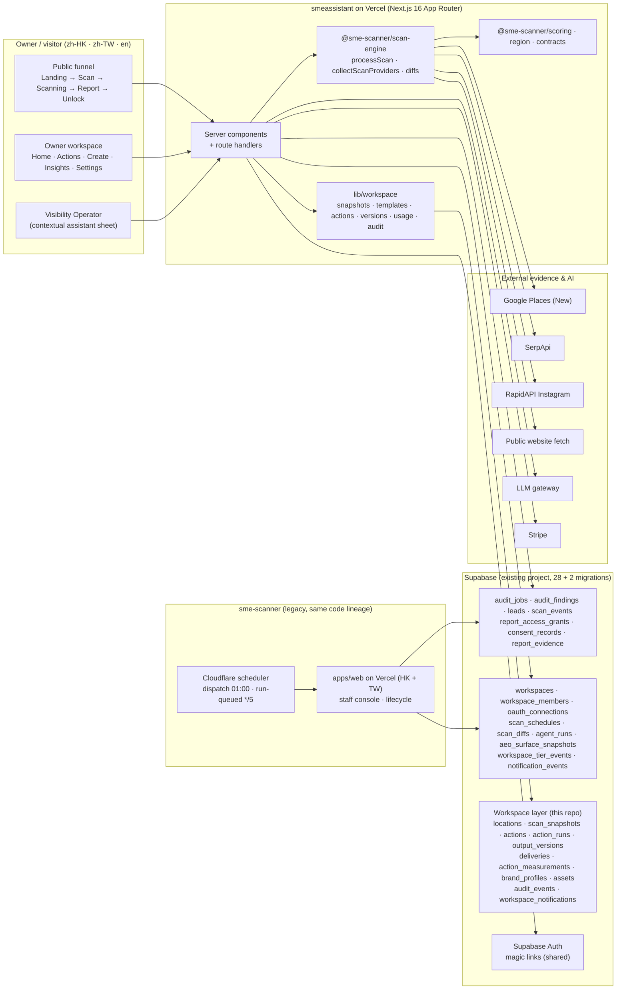

# Architecture — SME Scanner Visibility Workspace

This is the "final code lives here" repo for the Visibility Workspace: a Next.js 16 App Router app on Vercel that vendors the
`sme-scanner` scan engine and scorer verbatim, shares the existing Supabase project with the legacy app, and adds the owner
workspace layer (snapshots, actions, versions, approvals, exports, usage). The decisions below were taken in the integration
playbook (`CLAUDE.md` §2) and are not re-litigated per phase.

## Decisions

| # | Decision | Why |
|---|---|---|
| D1 | Upstream's packages are vendored verbatim as workspace packages: `packages/scoring`, `packages/region`, `packages/scan-engine` (+ `VENDOR.md` with the pinned SHA `b9b4151f`). | Byte-compatibility with the executor that writes the shared database. |
| D2 | Same Supabase project. All 28 upstream migrations copied verbatim; this repo appends additive migrations only (`20260903000000_workspace_layer.sql`, `20260903000001_workspace_rpcs.sql`). `workspaces`, `workspace_members`, `oauth_connections`, `scan_schedules`, `scan_diffs`, `agent_runs`, `aeo_surface_snapshots` are reused, never recreated. | Both apps read and write the same rows. |
| D3 | `packages/contracts` holds the upstream type files scan-engine reaches into; the vendored engine's relative type imports point there. | This repo has no `apps/web`. |
| D4 | Standard Next.js 16 App Router on Vercel; request interception in `proxy.ts`; the four `@sme-scanner/*` packages are transpiled. | Upstream packages ship raw TypeScript. |
| D5 | Root app plus `packages/*`, pnpm 9.12.0 via corepack, Node 22. | Minimal churn from the prototype. |
| D6 | Real route segments; server components load data and hand typed props to the client components that carry the design. | SEO, metadata and auth per segment. |
| D7 | Scan execution is upstream's pipeline unchanged: `POST /api/scan/start` queues, the scanning page posts `/api/scan/process`, `processScan` claims through `claim_audit_job`. No cron routes here; the legacy scheduler dispatches and reaps. | One executor semantics on the shared table. |
| D8 | The scorer is untouched. Workspace numbers come from `audit_jobs.module_results` / `score_coverage`; comparability from `scan_diffs`; `scan_snapshots` holds only workspace metrics and website checks. | Two sources of truth would disagree. |
| D9 | Ownership and access reuse upstream: magic links, `workspace_members` roles, OAuth-verified claim, Google Business connection, Stripe tier `lite\|paid`. Delivery is export or copy only. | Guardrail 15; those flows are live already. |
| D10 | Demo surfaces keep fixed data; a seeded `is_demo` workspace exercises the real code path. | Guardrail 12. |
| D11 | Vitest 4, Playwright 1.61, ESLint (`eslint-config-next`), Tailwind 4; no Supabase CLI; migrations verified through Docker. | Matches the prototype's pins and upstream's gates. |
| D12 | The legacy app coexists until cut-over; this app never reads with the anon key and never grants to `authenticated`. | Shared tables, Auth and Storage. |

## Layers

| Layer | Where | Notes |
|---|---|---|
| Public funnel | `app/[locale]/{page,scan,scanning,r,unlock,pricing,methodology,trust,legal}` | Upstream API contracts re-implemented byte for byte (`app/api/{business,scan,report-access}`). |
| Auth and membership | `lib/auth.ts`, `app/auth/callback`, `proxy.ts` | Upstream `authorizeWorkspace` decides; staff sessions never accepted here. |
| Workspace data | `lib/workspace/*` | `snapshots` → `actions` → `overview` → `queries-pages`; `versions`/`usage` wrap the RPCs; `measurements`, `notify`, `rescan`, `team`, `brand`, `assets`. |
| Agents and assistant | `lib/agents/*`, `lib/assistant/*` | One guardrailed system prompt, zod output; the assistant never mutates state. |
| UI | `components/workspace/*`, `components/*` | Prototype design and copy preserved; every number bound to rows. |
| Database | `supabase/migrations`, `supabase/seed`, `test/integration` | RLS on, zero policies, service-role only; Docker harness for the integration suite. |

## Runtime topology

## The product loop

`Discover → Diagnose → Prioritise → Draft → Approve → Export → Re-scan → Prove change`

| Step | Implemented by | Persists to |
|---|---|---|
| Discover | `POST /api/scan/start` + `POST /api/scan/process` → `processScan` | `audit_jobs` |
| Diagnose | `scoreAll()` in scan-engine; `buildSnapshot()` after persist | `audit_findings`, `audit_jobs.module_results`, `scan_snapshots` |
| Prioritise | `deriveActionsForSnapshot()` | `actions` (with `priority_factors`) |
| Draft | `POST /api/actions/[id]/run` → agent prompt → `llmComplete` | `action_runs`, `output_versions` |
| Approve | `POST /api/versions/[id]/approve` (RPC, idempotent) | `output_versions`, `audit_events` |
| Export | `POST /api/versions/[id]/export` (first export counts one delivery) | `deliveries`, `workspace_usage` |
| Re-scan | `POST /api/workspaces/[id]/rescan` or `scan_schedules` (monthly) | new `audit_jobs` row with `parent_job_id` |
| Prove change | `scan_diffs` (scan-engine) + `recordMeasurements()` | `scan_snapshots.comparable_to`, `action_measurements` |

## Non-negotiables

Never a second score; missing evidence lowers coverage, never the score. No auto-publishing; one delivery counts only after
exact-version approval and export. Ownership only through Google verification or staff assignment (`OWNER_SELF_SERVICE_CLAIM` is
never set). No demo data on non-demo pages. RLS on with zero policies; every read uses the service-role client after
application-layer authorisation; the anon key is used for `auth.*` only.
