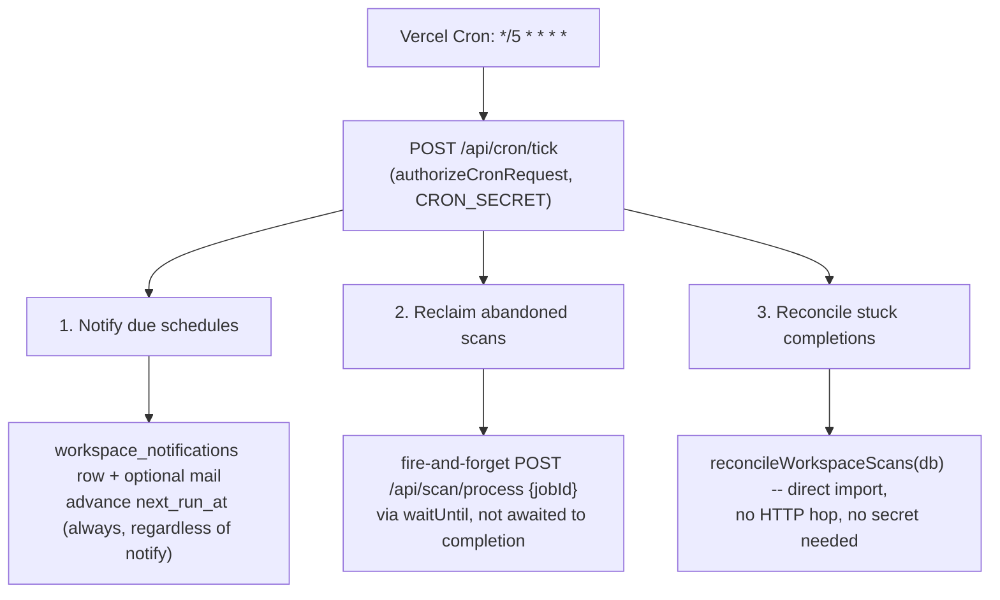

# Scan scheduler trigger

Date: 2026-09-13
Status: Approved design. Not implemented. No code, migration, deployment or hosted action follows from this document.
Baseline: `claude/session-development-6a86ea` at `943281b`, which is `main` at `943281b` (PR #14, merged).

## Outcome and scope

This is Phase 3 (owner-platform-v1) item P3.1, narrowed. The Master Plan's P3.1 describes a full durable job lifecycle — leases, checkpoints, retry caps, reaping, fenced dispatch — as if none of it exists yet. Most of it already does: the atomic 30-minute/3-attempt claim lease (`lib/scan/execution-store.ts`), and a fenced workspace-completion receiver with its own reconcile mode (`lib/workspace/completion.ts`, `app/api/internal/workspace-scan-completion/route.ts`) that already reprocesses up to five stuck jobs without re-running collectors. What's missing is narrower than the phase-prompt implies: **nothing currently calls any of this on a schedule.** No cron is registered, and a manual "Rescan now" click is the only path that runs today.

This design covers only that gap: one new Vercel Cron, one new route, three bounded concerns. It does not touch the claim lease, the completion receiver's internals, or the `scan_schedules` computation helpers — all reused exactly as they are.

Out of scope, deliberately: P3.2 (re-scan comparison reachability), P3.3 (billing/seats), P3.4 (analytics reliability), P3.5 (operating controls / dead-letter / budgets) — each is its own independent piece of the Master Plan's Phase 3 and gets its own design when it's next. Also out of scope: per-module checkpoint/resume (today's claim-and-retry model re-runs the whole collect→score→persist pipeline on reclaim, up to 3 attempts total, which this design accepts rather than redesigns), and any new standing-consent concept for automated scans (see below — this design avoids needing one at all).

## Constraints this design is shaped by

**No external scheduler exists anymore.** The historical assumption in this repo's root `CLAUDE.md` — that a legacy Cloudflare Worker on a separate Supabase-era app ticks `run-queued` every 5 minutes and may pick up this app's jobs too — is stale. The Neon migration cut that relationship entirely: `docs/integration/NEON-RUNNER-COMPATIBILITY.md` hard-blocks `scheduled`/`cloudflare` execution runtimes in code, and `SCAN_EXECUTION_RUNTIME` is fixed to `vercel`. The comment in `lib/workspace/rescan.ts` ("no cron in this repo; the monthly cadence is a `scan_schedules` row the legacy scheduler dispatches") is now incorrect and gets corrected as part of this work.

**Hosted deployment is NOT CHOSEN.** Per `docs/integration/NEON-CUTOVER.md`, no Neon project, Vercel origin, or scheduler owner has been selected yet. This design cannot be proven by watching a real cron fire; it's verified locally (unit + Docker-Postgres integration tests) with a documented manual step for whenever hosted acceptance is authorized.

**The project is now on Vercel Pro** (confirmed by the user, correcting this design's own earlier assumption of Hobby). Cron can run as often as once a minute; the once-daily Hobby ceiling that motivated the historical "no cron" rule no longer applies.

**The consent gate cannot be satisfied by a machine.** `lib/scan/consent.ts::parseScanConsent` requires a request body asserting `public_evidence_consent: true` with a `consent_policy_version` matching the *currently published* version — deliberately, so a stale consent can't be silently reused. `enqueueRescan` takes this as a required input it never synthesizes itself. There is no way for an unattended cron to produce a valid one. Rather than invent a new standing-consent record (a real product/legal surface), this design has the cron **notify, not dispatch** — it never calls `enqueueRescan` at all.

## Architecture

One new route, one new Vercel Cron entry, three concerns run in sequence — not three separate crons, preserving "one scheduler."



Each concern is wrapped in its own try/catch so a failure in one doesn't block the others. The route returns 200 with a small summary (`notified` counts, `reclaimCandidates` -- how many were found, not necessarily dispatched or completed -- and `reconciled` broken down by outcome status) unless the request itself is unauthenticated.

### 1. Notify due schedules

```sql
SELECT * FROM scan_schedules WHERE cadence = 'monthly' AND next_run_at <= now()
```

For each due row, load its workspace. If `workspaces.tier = 'paid'` **and** `notify_monthly_digest = true`, insert a `workspace_notifications` row (`kind: 'schedule.due'`, bilingual title/body from `lib/copy.ts`, `href` to the location's rescan action) and attempt a best-effort email via the existing `createMailTransport()` (safely no-ops today; Resend isn't configured until DEC-07 is resolved). Regardless of tier or preference — even when the notification is skipped entirely because the workspace is lite-tier or has digests off — **always** advance `next_run_at` to the next anniversary via the existing `nextRunAfter()` helper, in the same transaction. Otherwise a lite-tier or digest-off workspace would be re-evaluated as "due" on every 5-minute tick for a month instead of just once; skipping the notification must never mean skipping the schedule's own advance.

This never calls `enqueueRescan`. The owner still clicks "Rescan now" themselves, which still goes through the unchanged, unmodified consent flow. Automating the reminder is the whole of what "recurring" means here; automating the consent is explicitly not attempted.

### 2. Reclaim abandoned scans

```sql
SELECT id FROM audit_jobs
WHERE status = 'queued'
   OR (status IN ('collecting','scoring','persisting') AND attempt_count < 3 AND last_attempt_at < now() - interval '30 minutes')
LIMIT 20
```

This mirrors the claim UPDATE's own WHERE clause exactly; factor it into one shared predicate so the two cannot drift apart. For each id, fire `POST {APP_ORIGIN}/api/scan/process {jobId}` without awaiting completion, kept alive past the route's response via `waitUntil` — the same pattern `recordTerminal`'s analytics tail already uses. The batch cap (20) bounds the tick's own duration; anything left over is picked up on the next tick 5 minutes later, which is acceptable since these jobs are by definition already stale by at least 30 minutes.

The "trigger scan processing" step is an injectable dependency (defaulting to a real `fetch` + `waitUntil`), matching the dependency-injection pattern already used for provider calls elsewhere in this codebase — so tests can assert "called with this jobId" without a real network call.

**Needs verification during implementation, not assumed here:** `/api/scan/process` rate-limits by `{scope: "scan_process", identifier: jobId}`. A reclaim 30+ minutes after the original click is almost certainly outside that window, but if it isn't, a stuck job could be silently re-refused by its own rate limiter forever. Check the limiter's actual window before relying on this path.

### 3. Reconcile stuck completions

The route imports and calls `reconcileWorkspaceScans(db)` directly from `lib/workspace/completion.ts` — same process, no HTTP hop, no secret. This is awaited synchronously (bounded to 5 jobs, no collectors, already fast by design).

`WORKSPACE_COMPLETION_ENABLED` gates only the HTTP route (`app/api/internal/workspace-scan-completion/route.ts`), which stays untouched and still 404s to any network caller until that flag is separately authorized. The cron's in-process call bypasses that gate entirely, which is correct: the cron is trusted server code, not a network caller, and enabling external HTTP access to this endpoint remains a distinct, still-pending decision.

## Config and the cron-registration test

**New route:** `app/api/cron/tick/route.ts`, `maxDuration = 60` (matching the existing completion route).

**Auth:** reuses `authorizeCronRequest` / `cronUnauthorizedResponse` from `lib/security/cron-auth.ts` as-is — already fully built, currently dead code (nothing calls it yet). `CRON_SECRET` is already a documented `.env.example` variable; it needs an actual value set at deploy time, which is a hosted-acceptance task, not a code task.

**`vercel.json`** adds one `crons` entry, preserving the existing `git.deploymentEnabled` guards untouched:

```json
{
  "git": { "deploymentEnabled": { "codex/merchant-acceptance-completion": false, "codex/neon-migration": false } },
  "crons": [{ "path": "/api/cron/tick", "schedule": "*/5 * * * *" }]
}
```

**`tests/cron-registration.test.ts`** currently asserts `crons` stays empty. That assertion was written for a world where a different app's Cloudflare Worker ticked the shared database and this project's own Hobby plan couldn't run anything sub-daily regardless. Neither is true anymore. Per the phase-prompt's own instruction not to simply delete a failing architecture test, this gets rewritten to assert **exactly one** cron entry, at exactly this path and schedule — so it still fails loudly if a second cron is ever added later, preserving the "one scheduler" intent rather than abandoning it.

## Testing and what "done" means here

Hosted deployment is still NOT CHOSEN, so this cannot be proven by watching a real Vercel Cron fire against a live deployment — that's a hosted-acceptance gate for later.

What's verified locally:

- **Route tests** for `app/api/cron/tick`: 401 without a valid `CRON_SECRET` bearer; given fixture due schedules, the notify/advance/tier-gating behavior above; given fixture stuck jobs, the reclaim trigger fires (mocked dependency, no real network call).
- **Integration test** (Docker Postgres, `test/integration/`): seed a due schedule and a stuck job, hit the route, assert the DB state actually changed (notification row, advanced `next_run_at`).
- **Reused, not re-tested:** `reconcileWorkspaceScans`'s own internals already have coverage from the existing completion route's tests; this slice only confirms the cron calls it.

Definition of done: local unit + integration tests green, `tests/cron-registration.test.ts` updated and green, and a documented manual step for whoever eventually runs the hosted-acceptance gate (register `CRON_SECRET`, confirm the cron fires post-deploy) — not a live-fire demonstration now.

Report artifacts for this slice (once implemented) go to `docs/implementation/owner-platform-v1/PHASE-3-REPORT.md` and `PHASE-3-TEST-RESULTS.md`, per the phase-prompt's own instruction — not `docs/integration/PHASE-3-REPORT.md`, which already exists and belongs to the older, unrelated CLAUDE.md Part B phase numbering (workspace data layer, not recurring/commercial service).
