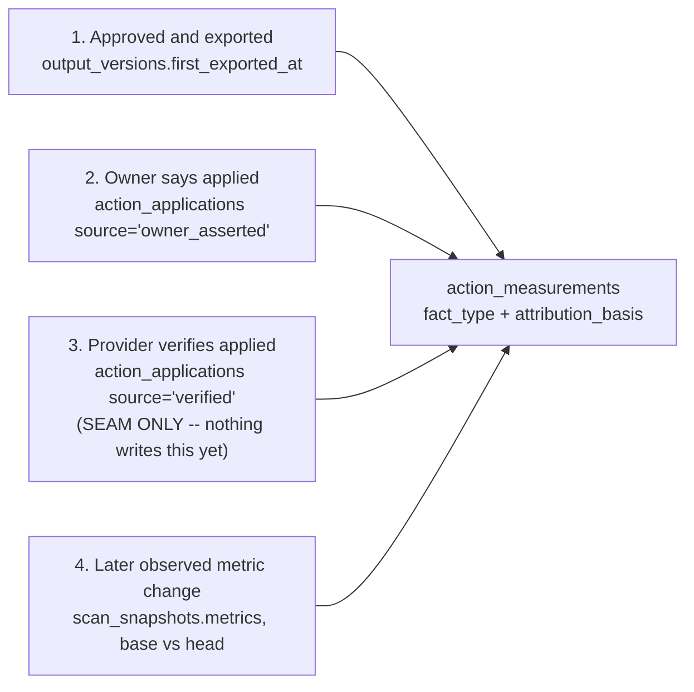

# Applied evidence: owner-asserted application and the verifier seam

Date: 2026-09-16
Status: Approved design. Not implemented. No code, migration, deployment or hosted action follows from this document.
Baseline: `main` at `84bae0b` (PR #15, merged — P3.1 scan scheduler dispatch).

## Outcome and scope

This is Phase 3 (owner-platform-v1) item P3.2, narrowed to its one real gap.

P3.2 as written in the Master Plan reads as a large repair. Most of it is already built. An exploration of the baseline found four of its six requirement bullets already satisfied by the `2026-09-08-two-scan-comparison` work and Phase 2:

| P3.2 requirement | Where it already lives |
|---|---|
| Membership resolution through `loadReport`; both scans authorized independently | `lib/report/load-report.ts` passes a per-candidate `authorizeJob`; `lib/report/comparison/load.ts` will not call `readInput` on a candidate until that returns non-public |
| Re-scan reachable only under an approved entitlement policy | `app/api/workspaces/[workspaceId]/rescan/route.ts`: membership + location scope, then `isWorkspacePaid` fail-closed (403 `tier_required`), then a rate limit, then live `parseScanConsent` |
| Time decay distinguished from regression | `DECAY_FINDING_KEYS` in `packages/scoring` |
| `Attributed` / `Observed` / `Unknown` semantics preserved | `lib/workspace/measurements.ts` |

What is genuinely missing is the plan's central requirement: **"Keep four different events separate: approved/exported; owner says applied; provider/check verifies applied; later observed metric change."** Only two of those four exist. There is no owner-asserted application record anywhere in the baseline — no `applied_at`, `marked_applied`, or equivalent column, table, or route — and nothing verifies an applied change against a provider. The closest thing is `action_state='completed'`, which means "the owner is done with this task" and is already being leaned on as a stand-in for having entered the loop (`lib/workspace/measurements.ts`, the `entered` set).

This design covers that gap: one new table, one new route pair, one new column on `action_measurements`, and the removal of the `completed`-as-proxy hack.

Out of scope, deliberately:

- **Any actual provider verifier.** The design defines where a verifier writes and what it may claim; it builds none. Building one means a per-template check (refetch the website to confirm FAQ JSON-LD landed; confirm a specific review now carries an owner reply) and, for the GBP and Instagram templates, provider quota. That is its own piece of work with its own design.
- **Separating the conflated `ScanComparison` unavailable reasons.** `no_accessible_pair` currently fires for three distinct situations the plan names separately: no earlier scan exists, an earlier scan exists but authorization denied it, and an authorized earlier scan shares no comparable cohort. This is a real P3.2 gap and a contained one; it is a deliberate follow-up, not part of this design.
- **The plan's browser acceptance artifacts.** A real comparable pair proven in a browser and negative authorization examples need hosted access and explicit authorization (see "What this design cannot prove" below).
- P3.3 (billing/seats), P3.4 (analytics), P3.5 (operating controls) — each independent, each gets its own design.

## Constraints this design is shaped by

**The fact-type vocabulary is fixed.** Guardrail 4 fixes six labels: `Observed | Inference | Recommended | Attributed | Estimated | Unknown`. This design does not add a seventh. Distinguishing "the owner says so" from "we confirmed it" therefore cannot be done by inventing a fact type; it is done with a separate basis field that travels with the fact type wherever it is displayed.

**Migrations `0001`–`0005` are immutable.** A new `0006` is required, and it must carry its own `GRANT ... TO sme_app_runtime`: the grants for every existing table live in `0003_workflows.sql`, which cannot be extended.

**`fence_workspace_completion_write` is opt-in.** The `actions` table carries this trigger, but it returns immediately unless the `app.completion_job` / `app.completion_token` session variables are set, which only the workspace completion receiver does. An ordinary owner request does not trip it. This was verified by reading the function in `0004_atomic_operations.sql`, not assumed.

**Export is not publication.** The plan states this directly: "'Exported' is not 'published' or 'implemented.'" It is the reason the basis precedence below is ordered the way it is, and the reason this gap matters at all — the product currently reaches `Attributed` on the strength of a file download.

## Architecture

Four events, kept distinct at the data layer:



Events 2 and 3 share one table because they answer the same question — "was this applied?" — with different authority, recorded in `source`. Event 1 stays where it is. Event 4 is the snapshot pair. `attribution_basis` on the measurement records which of 1–3 actually applied, so a self-report is never displayed as a confirmation.

### 1. Data model — `neon/migrations/0006_action_applications.sql`

```sql
create table if not exists public.action_applications (
  id                uuid primary key default gen_random_uuid(),
  workspace_id      uuid not null references public.workspaces(id) on delete cascade,
  action_id         uuid not null references public.actions(id) on delete cascade,
  output_version_id uuid references public.output_versions(id) on delete set null,
  source            text not null check (source in ('owner_asserted','verified')),
  asserted_by       uuid references public.app_users(id) on delete set null,
  asserted_at       timestamptz not null default now(),
  evidence          jsonb,
  note              text,
  retracted_at      timestamptz,
  retracted_by      uuid references public.app_users(id) on delete set null,
  created_at        timestamptz not null default now()
);

create index if not exists action_applications_action_idx
  on public.action_applications (action_id, asserted_at desc)
  where retracted_at is null;

grant select, insert, update, delete on table public.action_applications to sme_app_runtime;
```

Reasoning behind the non-obvious choices:

- **Every FK states `on delete` explicitly**, per the delete-graph rule. Merchant content cascades; actor provenance sets null. `output_version_id` sets null rather than cascading: losing a version must not erase the fact that the owner applied something.
- **Retraction is a stamp, not a delete.** The owner can correct themselves without the record vanishing. Measurement logic ignores retracted rows; the history survives (guardrail 10, append-only accountability).
- **`asserted_by` is nullable only because of `on delete set null`.** The route always writes a real actor.
- **No unique constraint on `(action_id, source)`.** Re-applying after a new approved draft is a legitimate second row, and a future verifier may check repeatedly. Ordering decides which row counts, not uniqueness. Duplicate-submit protection is the route's job (below), not the schema's.
- **`evidence jsonb` is null for owner assertions** and is where a verifier records its proof.

One column on an existing table:

```sql
alter table public.action_measurements
  add column if not exists attribution_basis text
  check (attribution_basis in ('exported','owner_asserted','verified'));
```

Nullable, and **not backfilled**. Every existing row predates this and there is no honest value to write — a backfill would be inventing a claim about what an owner did. `action_measurements.fact_type`'s existing CHECK is untouched.

### 2. Write path

Today the only route to `action_state='completed'` is `markChecklistDone` in `components/workspace/action-detail-client.tsx`, which is checklist-only; drafted actions have no completion control at all. The assertion control generalises it — the same gesture for checklists, newly available for drafted actions where it can carry the version reference.

**`POST /api/actions/[actionId]/applied`** — body `{ output_version_id?: uuid, note?: string }`

Authorization mirrors every other action mutation: `authorizeWorkspaceRequest` with `minRole: "manager"` and the action's `location_id`. Viewers and out-of-scope managers are refused before any data read. The action is resolved from the authorized workspace, never from the request body.

Validation, cheapest refusals first:

1. `actionId` shape, then body shape.
2. If `output_version_id` is present, it must belong to **this** action and be `approval_state='approved'`. Asserting publication of an unapproved draft contradicts guardrail 5 — the product would record a delivery of something nobody approved.
3. The action's `action_state` must not be `dismissed`, `cancelled` or `expired`.

Then one transaction:

- insert the `action_applications` row with `source='owner_asserted'`;
- `update actions set action_state='completed', completed_at=now()`;
- emit an `audit_events` row, event `action.applied`, registered in `lib/workspace/audit-labels.ts` alongside the existing names.

**Idempotency:** if a non-retracted `owner_asserted` row already exists for this action with the same `output_version_id`, return 200 with the existing row instead of inserting. A double-clicked button must not become two assertions.

**`DELETE /api/actions/[actionId]/applied`** stamps `retracted_at` / `retracted_by` on the newest non-retracted assertion, returns the action to `action_state='in_progress'`, clears `completed_at`, and emits `action.application_retracted`.

`in_progress` is chosen over re-deriving the action's prior state: it is valid in the existing CHECK constraint, it is honest (the owner has engaged with this and it is not done), and re-deriving would mean reimplementing the derivation rules in a second place where they could drift from the first.

**Rate limit: reuse the existing `action_mutation` scope** (120/hour, keyed per session user plus the source-IP HMAC). Planning revised this from a new `applied` scope: `authorizeActionMutation` in `app/api/actions/_shared/mutation.ts` already performs the whole front half of this route — UUID check, action-scope load, `minRole: "manager"` with the action's location, then the limiter, fail-closed — and `action_mutation` is described in `lib/security/rate-limit.ts` as a runaway-write guard for exactly this class of cheap authenticated write. A new scope would duplicate that with no behavioural difference.

**The verifier seam** is a typed function, not a route:

```ts
recordApplication(repo, { source: 'verified', actionId, workspaceId, evidence })
```

Same insert path, different `source`. A future verifier calls it. Nothing calls it today. There is no route, no scheduler entry and no empty second table: the seam is one exported function and the `source` value it is permitted to write.

### 3. Measurement semantics

**Basis precedence: `verified` > `owner_asserted` > `exported`.**

This ordering is deliberate and it inverts the intuitive one. An export tells us a file left the building; the owner saying they published it is a closer claim about the world, even though it is unverified. Only a verifier outranks the assertion. `attribution_basis` records which signal actually applied.

Fact type keeps its vocabulary and nearly its rule:

```
known = before !== null && after !== null
fact_type = !known    -> 'Unknown'
          | any basis -> 'Attributed'
          | otherwise -> 'Observed'
```

An owner-asserted checklist fix can now reach `Attributed`, which it never could before. `attribution_basis='owner_asserted'` travels with it to every display, so this widening never presents a self-report as a confirmation.

**The timing rule extends unchanged.** An application counts only if `asserted_at < headStartedAt` — the same test `lib/workspace/measurements.ts` already applies to `first_exported_at`. An assertion made after the head scan finished cannot explain that scan's numbers; honouring one would be exactly the "causal claim from timing alone" the plan forbids.

**The `completed`-as-proxy hack is removed.** `lib/workspace/measurements.ts` currently infers "the owner entered this into the loop" from `action_state === 'completed' || exportedBeforeHead`. Its own comment documents the bug it was patching: untouched `recommended` actions being badged "Measured", the loop's terminal success state, next to a pending approval step. With a real signal, `entered` becomes "has a non-retracted application before head, or exported before head."

**One documented exception.** Existing workspaces hold `completed` actions with no application row; they would silently lose their `measured` label. The `action_state === 'completed'` test therefore survives inside that expression as a dated fallback. It costs one boolean, it prevents a regression in live data, and the code must say both why it is there and that it should be removed once no pre-`0006` completed actions remain.

**Immutability holds.** `recordMeasurements` is already idempotent per (action, head snapshot) and explicitly preserves the saved classification on replay. `attribution_basis` is written once at insert and never rewritten. A later retraction does not rewrite history; it only affects measurements not yet taken. Rows predating this migration keep `attribution_basis = null`.

### 4. Read surface

Four places, with one constraint throughout: a self-report must never be dressed up as an observation.

**Action detail.** The assertion control replaces `markChecklistDone` and becomes available to drafted actions. For a drafted action it offers the approved version being asserted about, defaulting to the latest approved one; for a checklist there is nothing to pick. The existing `FactType` component already carries the vocabulary, so the applied state renders as its own row in the fact stack:

- before: "Mark as applied · we record what you tell us; the next scan is what checks it"
- after: "You marked this applied on {date} · not independently verified", with a retract link

This is close to what `action-detail-client.tsx` already says in its own comment about the checklist control ("This is the owner's own confirmation, not an observation"). The design makes the data model honest about something the copy already had right.

**Actions list.** `displayPhaseKey` in `lib/workspace/overview.ts` gains one phase, `applied`, slotted after `exported` and before `awaiting_comparable_scan`. It means "the owner says this is live and no comparable scan has judged it yet" — a distinct place in the loop that currently has no label.

**Measurement display (Home "previous action outcome", and the action detail page's "Before and after" card).** Wherever a *measurement's* `fact_type` appears, the basis appears with it. Note Insights is not one of these surfaces: its metric cards compare snapshot to snapshot and are always `Observed` or `Unknown`, never `Attributed`, so they carry no basis. `Attributed · you reported applying this` reads very differently from `Attributed · exported 12 Sep` or a future `Attributed · verified on site`, and that difference is the whole point of the four-event requirement. A null basis on pre-migration rows renders as `Attributed · basis not recorded`, never as a guess.

**Copy.** New strings go in `lib/messages/{en,zh-HK,zh-TW}.json`. Note that `action-detail-client.tsx` uses inline `isChinese ? … : …` ternaries, which collapses zh-HK and zh-TW into one string. That is the file's existing convention and this design does not rewrite it — but "marked as applied" wants a different register in HK than in TW, so these particular strings go through the messages files rather than adding more `isChinese` ternaries.

## Testing

**Migration.** `pnpm db:verify` against disposable Docker Postgres: `0006` applies cleanly three times, the delete graph shows an explicit `on delete` on all five new FKs (`workspace_id`, `action_id`, `output_version_id`, `asserted_by`, `retracted_by`), and the `sme_app_runtime` grant takes effect. That last check matters disproportionately: the grants for existing tables live in the immutable `0003`, so a `0006` that forgets its own grant leaves the table unreachable at runtime while every unit test still passes.

**Unit (`lib/workspace/measurements.test.ts`)** — where the real risk is:

- basis precedence across all combinations of the three signals;
- an assertion with `asserted_at > headStartedAt` does **not** produce `Attributed` (the anti-causality rule);
- a retracted assertion is ignored;
- the legacy fallback: a `completed` action with no application row keeps its `measured` label;
- replay preserves `attribution_basis` on an existing row rather than recomputing it;
- `Unknown` still wins when a metric is missing, whatever the basis.

**Route tests** — viewer 403 and out-of-scope manager 403, both before any data read; a version belonging to a different action rejected; an unapproved version rejected; double POST yields one row; retraction returns `in_progress`; a `dismissed` action refused.

**Integration (`NEON_INTEGRATION=1`, real Postgres in Docker)** — the assertion and the `action_state` update commit together or not at all; `fence_workspace_completion_write` is not tripped by an ordinary assertion, asserted by writing with the session variables unset, which is the actual production path; a measurement built after a real assertion carries `owner_asserted`.

**Component test** — the control's three states, and its absence for viewers.

## What this design cannot prove

Stated here so the eventual phase report does not have to discover it:

- **`source='verified'` gets an insert-path unit test and nothing end-to-end**, because no verifier exists. The seam is exercised as a function contract, not as a working feature.
- **The plan's acceptance gate wants a real comparable pair proven in a browser**, plus negative authorization examples. That needs hosted access and explicit authorization, and stays a documented manual step — the same category as P3.1's unset `CRON_SECRET`.
- **`pnpm build` is expected to remain blocked on Windows** by the standing Turbopack/`radix-ui` module-resolution issue recorded in `PHASE-1-TEST-RESULTS.md`, `PHASE-2-TEST-RESULTS.md` and `PHASE-3-TEST-RESULTS.md`. It is unrelated to this work and should be recorded as blocked, not worked around by substituting a different bundler into the gate.

Report artifacts for this slice append to `docs/implementation/owner-platform-v1/PHASE-3-REPORT.md` and `PHASE-3-TEST-RESULTS.md`, alongside P3.1's.
