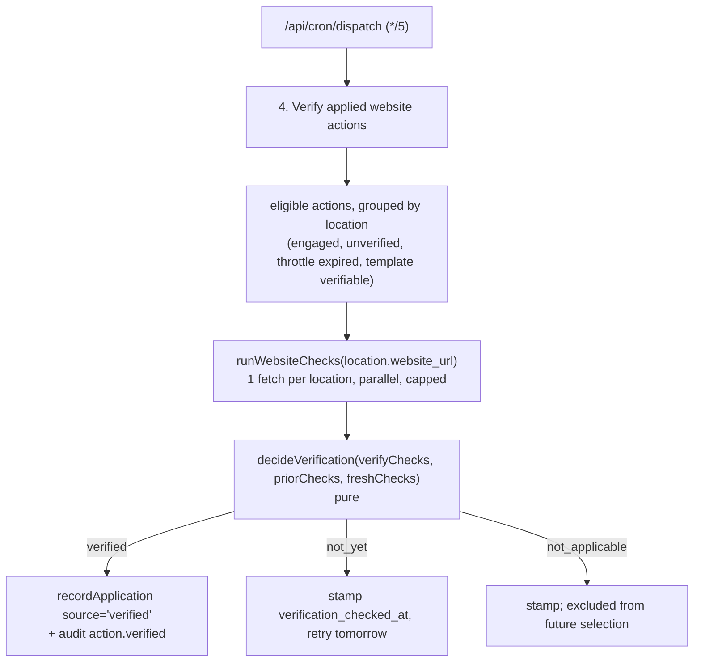

# Website verifier: making `source='verified'` real

Date: 2026-09-16
Status: Approved design. Not implemented. No code, migration, deployment or hosted action follows from this document.
Baseline: branch `worktree-p32-rescan-reachability` at `c9c6fe9` (PR #16, open, CI green), which is `main` at `84bae0b` plus P3.2.

## Outcome and scope

P3.2 built the four-event model the Master Plan requires — approved/exported, owner says applied, provider verifies applied, later observed change — but built only three of the four. The third shipped as a seam: `recordApplication(repo, { source: 'verified', ... })` exists, is typed, and has no caller. `strongestBasis` already ranks `verified` above `owner_asserted` above `exported`, and `attribution_basis = 'verified'` already renders as "verified on site" in all three locales.

This design gives that seam its first caller, for the two website-backed templates. Nothing else in the four-event model changes.

Out of scope, deliberately:

- **Verifiers for GBP and Instagram templates.** Confirming a review now carries an owner reply, or that story highlights exist, means provider calls against quota — a different cost model and a different authorization question (DEC-04). The website verifier needs only an HTTP fetch of the owner's own site.
- **Proving the owner applied *our* draft.** See "What this cannot prove" below. This is a limit of the approach, stated rather than engineered around.
- **Re-verification / monitoring.** Once an action is verified the row is written and the action is never re-checked. `action_applications` is append-only evidence, not a site monitor.
- The remaining Phase 3 items (P3.3 billing, P3.4 analytics, P3.5 operating controls) and P3.2's deferred `ScanComparison` state-splitting.

## Constraints this design is shaped by

**One scheduler.** P3.1 established a single cron entry and `tests/cron-registration.test.ts` asserts exactly one. The verifier is a fourth concern inside `/api/cron/dispatch`, not a second cron.

**This is the product's first scheduled outbound traffic to customer infrastructure.** Everything else it fetches is a provider it pays. Politeness to the owner's server is a design constraint, not an optimisation: one fetch per location per tick, a hard batch cap, and a 24-hour throttle per action.

**`runWebsiteChecks` already exists** in `lib/website/checks.ts` with an injectable `fetch` and a 5-second timeout, and already computes all fifteen checks. The verifier reuses it rather than writing a second fetcher whose results could disagree with the one that produced the finding.

**The copy already exists.** Task 9 shipped `basis.verified` in all three locales, including the zh-HK 核實 / zh-TW 查證 register split. No new basis copy is needed.

## Architecture



### 1. What gets declared and stored

**Template declaration.** Each entry in `lib/workspace/templates.ts` gains one optional field beside `triggerFindingKeys`:

```ts
verifyChecks?: readonly WebsiteCheckKey[]
```

- `visibility-content` → `["faq_schema"]`
- `website-basics` → `["title", "meta_description_50_160", "single_h1"]`

Optional because most templates are not website-backed and never will be — a GBP photo pack has nothing a fetch could confirm. Absent means "not verifiable", a permanent and correct answer for those templates rather than a gap.

The field lives on the template for symmetry with `triggerFindingKeys`: the same row says what creates an action and what would evidence it is done, so a reader asking "why did this never verify?" finds the answer where the template is already defined. A test asserts the two website templates declare it.

**Migration `0007`:**

```sql
alter table public.actions
  add column if not exists verification_checked_at timestamptz;
```

Nullable and not backfilled — null means "never attempted", which is true of every existing row.

No RLS block is needed, unlike `0006`: `actions` already carries its four-statement block from `0003_workflows.sql`, and a new column inherits it.

It **does** need the two things P3.2 learned late (see that plan's Task 1 Step 2b): the Drizzle definition in `lib/db/schema/business.ts`, and the hardcoded expectations in `test/integration/neon-schema.integration.test.ts` — migration list, journal counts, catalog census, schema-module count. Predict the catalog delta from the migration first (here: columns +1, everything else unchanged) and confirm observation matches; pasting observed numbers converts a baseline guard into a description of current reality.

**Known smudge:** `verification_checked_at` is scheduling state on a domain table. `actions` is otherwise about what the owner should do; this column is about what the sweep has done. Accepted because a separate table for one nullable timestamp would be worse and the column doubles as operator visibility — but if `actions` accumulates further sweep state, that is the signal to move it out.

### 2. The decision rule

Pure, no I/O:

```
decideVerification(verifyChecks, priorChecks, freshChecks)
  -> "verified" | "not_yet" | "not_applicable"
```

```
relevant        = verifyChecks that FAILED in priorChecks

not_applicable  verifyChecks empty
                | no source snapshot
                | source snapshot's website_checks never evaluated those keys
                | relevant is empty (nothing was wrong, so nothing to confirm)
not_yet         some relevant check does not pass in freshChecks
verified        every relevant check passes in freshChecks
```

**The rule turns on what was actually failing, not on everything the template declares.** `website-basics` declares three checks, but an action often exists because only one of them failed. Requiring all three to have been failing would make that action permanently unverifiable, and requiring all three to pass now would withhold verification because of a check that was never the problem. `relevant` is the set that was genuinely broken at the source snapshot, and verification asks whether exactly that set is fixed.

`priorChecks` comes from `scan_snapshots.website_checks` via `actions.source_snapshot_id` — data already stored, needing no second fetch.

**Why the prior state is consulted at all.** "Passes now" alone would confirm a site that always passed: a `visibility-content` action can be triggered by `aeo.ai_overview_missing` while `faq_schema` was passing throughout, and verifying it would assert work nobody did. Reading the source snapshot is the cheapest correct guard, and it is more precise than mapping finding keys to check keys because it tests the check's actual recorded state rather than inferring from which finding fired.

**`not_applicable` is permanent and distinct from `not_yet`.** The first three conditions can never change for a given action, so such rows are excluded from selection rather than re-evaluated forever. `not_yet` means try again tomorrow.

A partial pass of the relevant set is `not_yet`, never `verified`: if two of the three `website-basics` checks were failing and only one is now fixed, the work is not done.

### 3. The sweep

A fourth concern in `/api/cron/dispatch`, in its own try/catch so a verifier failure cannot stop notify, reclaim or reconcile.

**Selection** — one query returning eligible actions joined to their location's `website_url`:

- the template declares a non-empty `verifyChecks`
- the owner engaged: an approved version was exported, **or** a live `owner_asserted` application exists
- no `verified` application row exists yet
- `verification_checked_at` is null or older than 24 hours
- ordered nulls-first, then oldest-checked, so nothing starves

Eligibility requires owner engagement because the four-event model's third event is "provider verifies **applied**". Verification corroborates a claim someone made; without engagement there is no claim to corroborate, and a third party's change to the site would otherwise be recorded as the owner's applied work.

**One fetch per location, not per action.** Group by location, fetch once, evaluate every eligible action for that location against the same result.

**Bounded:** at most 5 locations per tick, fetches issued in parallel via `Promise.allSettled` under `runWebsiteChecks`'s existing 5-second timeout. Worst case is roughly one timeout of wall-clock, inside the route's `maxDuration = 60` alongside the other three concerns. The cap bounds a single tick, not throughput.

**Every attempt stamps `verification_checked_at`**, including failures — an unreachable site, a timeout or a 500 stamps and moves on, so a permanently broken site is retried daily rather than every five minutes. Nothing is written to `action_applications` unless the decision is `verified`: a failed fetch is not evidence and must not become a row.

The route's response summary gains `verified: { locationsChecked, actionsVerified }`, reporting counts rather than claiming success — matching how the existing three concerns report.

### 4. What it writes, and where it surfaces

**Through the existing seam, unchanged:** `recordApplication(repo, { source: 'verified', workspaceId, actionId, evidence })`. No new write path, no new table, no change to the precedence rule.

- `asserted_by` is null — there is no human actor, and the column is nullable for exactly this case.
- `evidence` carries the proof: the URL fetched, the check keys tested, their prior state from the source snapshot, and the fetch timestamp. The column has been empty since `0006` awaiting this.
- A new audit event `action.verified`, actor type `system`, registered in `lib/workspace/audit.ts` and `lib/workspace/audit-labels.ts`.

**Measurement display needs no change.** `strongestBasis` already ranks `verified` highest; `attribution_basis = 'verified'` already renders "verified on site" on both surfaces. The first verified row surfaces correctly with no UI work.

**One gap must close.** Task 6 scoped `ActionOverview.applied` to `owner_asserted` rows only — correct then, since a verifier row rendering as "you marked this applied" would have put words in the owner's mouth. Now that verified rows can exist, an exported-then-verified action with no owner assertion would display "Exported" and hide the verification entirely.

So `ActionOverview` gains `verified` / `verifiedOn` beside `applied` / `appliedOn`, populated from the **same** `forActions` call — that query already returns both sources and one is currently discarded. A `verified` display phase slots above `applied` in `displayPhaseKey`: "we confirmed this is live on your site, and no comparable scan has judged the effect yet."

That needs one new phase string in `workspaceEn` and `workspaceZhHK`, **plus a `workspaceZhTW` override** — zh-TW does not inherit this one. Task 9 shipped a locale inversion by assuming inheritance was safe for a string carrying the 核實/查證 verb; the same trap is live here.

### 5. Testing

**The pure rule carries the weight.** All three outcomes, plus the boundaries where it would be easiest to get wrong:

- a check missing from the prior snapshot returns `not_applicable`, never `not_yet`
- a template whose declared checks were **all passing** at the source snapshot returns `not_applicable` — there was nothing to fix, so there is nothing to confirm
- only *one* of `website-basics`' three checks failing, and that one now passing, returns `verified` — the two that were never broken must not withhold it
- two relevant checks failing and only one now fixed returns `not_yet`
- empty `verifyChecks` returns `not_applicable`

**The sweep must not reach the network.** `runWebsiteChecks`'s injectable `fetch` is the seam; a stub returns fixture HTML. Cases: a now-passing site writes exactly one `verified` row; a still-failing site writes none but does stamp `verification_checked_at`; a timeout behaves as a failure; two actions on one location produce one fetch; the batch cap holds.

Those last two matter because a bug there is invisible in production until a customer reports the traffic.

**Integration, against real Postgres.** The eligibility query has four interacting conditions and is the piece most likely to be quietly wrong: an owner-asserted action is eligible; an exported-only action is eligible; an untouched action is not; an already-verified action is excluded permanently; one stamped an hour ago is excluded and one stamped 25 hours ago is included. Plus the write itself, since `recordApplication` with `source: 'verified'` has only ever been exercised as a type contract.

**One test closes the loop:** seed a verified row and a comparable snapshot pair, run `recordMeasurements`, assert the measurement is `Attributed` with `attribution_basis: 'verified'`. That proves the four-event model end to end for the first time — every prior test of the verified branch used a hand-made row.

## What this cannot prove

Stated here so the phase report does not have to discover it:

- **It does not prove the owner applied our draft.** It proves the check the scanner recorded as failing now passes. Their developer may have fixed it independently, a CMS template update may have added the markup, and no fetch can distinguish those. The copy says "verified on site", which is true, and deliberately not "verified you applied our draft".
- **It verifies two templates, not thirteen.** GBP and Instagram templates stay unverifiable until a provider-backed verifier is separately designed and authorized.
- **Nothing here is hosted verified.** The cron that runs the sweep still requires `CRON_SECRET` set in a real environment and a deploy — the same outstanding step P3.1 recorded.

Report artifacts append to `docs/implementation/owner-platform-v1/PHASE-3-REPORT.md` and `PHASE-3-TEST-RESULTS.md`.
